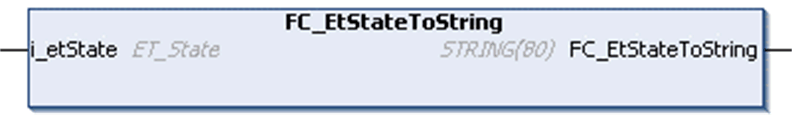

# FC\_EtStateToString

## Overview

|  |  |
| --- | --- |
| Type: | Function |
| Available as of: | V1.0.4.0 |
| Inherits from: | - |
| Implements: | - |

## Task

Convert an enumeration element of type ET\_State to a variable of type STRING.

## Functional Description

Using the function FC\_EtStateToString, you can convert an enumeration element of type ET\_State to a variable of type STRING.

## Interface

| Input | Data type | Description |
| --- | --- | --- |
| i\_etState | ET\_State | Enumeration with the present state. |

## Return Value

| Data type | Description |
| --- | --- |
| STRING(80) | The ET\_State converted to text. |

EIO0000002803.07