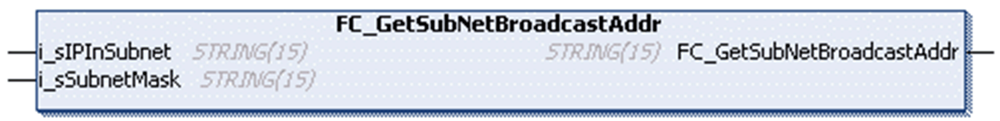

# FC\_GetSubNetBroadcastAddr

## Overview

|  |  |
| --- | --- |
| Type | Function |
| Available as of | V1.0.4.0 |
| Inherits from | - |
| Implements | - |

## Task

Calculate the broadcast address of a subnet.

## Functional Description

This function calculates a subnet broadcast IP for a specific IP and a subnet mask. A packet sent to this broadcast IP is received by the devices in this subnet. Use a subnet broadcast IP instead of a broadcast IP (255.255.255.255).

## Interface

| Input | Data type | Description |
| --- | --- | --- |
| i\_sIPInSubnet | STRING(15) | The IPv4 addresses of the subnet. |
| i\_sSubnetMask | STRING(15) | The subnet mask. |

## Return Value

| Data type | Description |
| --- | --- |
| STRING(15) | Broadcast IP of the subnet |

EIO0000002803.07