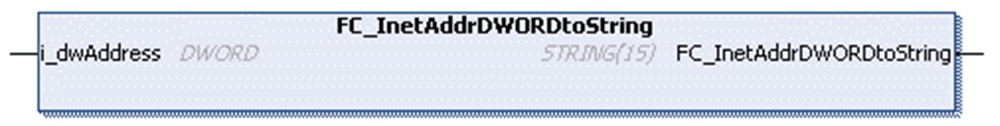

# FC\_InetAddrDWORDtoString

## Overview

|  |  |
| --- | --- |
| Type | Function |
| Available as of | V1.0.4.0 |
| Inherits from | - |
| Implements | - |

## Task

Convert the IPv4 address given as DWORD into STRING.

## Functional Description

This function converts an IP address from a DWORD representation into a STRING representation.

## Interface

| Input | Data type | Description |
| --- | --- | --- |
| i\_dwAddress | DWORD | The IPv4 address as DWORD. |

## Return Value

| Data type | Description |
| --- | --- |
| STRING(15) | The IPv4 address as STRING. |

EIO0000002803.07