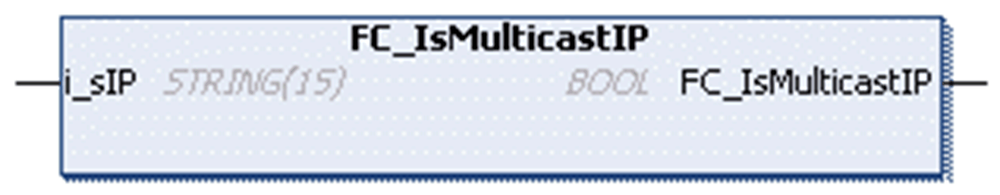

# FC\_IsMulticastIP

## Overview

|  |  |
| --- | --- |
| Type | Function |
| Available as of | V1.0.4.0 |
| Inherits from | - |
| Implements | - |

## Task

Determine whether a given IPv4 address is in the multicast range.

## Functional Description

This function determines whether the given IPv4 address is in the range of multicast addresses (224.0.0.0 to 239.255.255.255) according to RFC5771.

## Interface

| Input | Data type | Description |
| --- | --- | --- |
| i\_sIP | STRING(15) | Any IPv4 address |

## Return Value

| Data type | Description |
| --- | --- |
| BOOL | TRUE in case of multicast address, FALSE otherwise. |

EIO0000002803.07