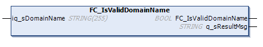

# FC\_IsValidDomainName

## Overview

|  |  |
| --- | --- |
| Type | Function |
| Available as of | V2.2.6.0 |
| Inherits from | - |
| Implements | - |

## Task

Determine whether the given string is a valid domain name.

## Functional Description

This function determines whether the syntax of the given string is a valid domain name in conformance with RFC1035.

## Interface

| In\_Out | Data type | Description |
| --- | --- | --- |
| iq\_sDomainName | STRING(255) | Domain name to be verified.  NOTE: Even if the data type references a string length of 255 characters, strings with greater length are allowed. |

| Output | Data type | Description |
| --- | --- | --- |
| FC\_IsValidDomainName | BOOL | If TRUE, the given string is a valid domain name. |
| q\_sResultMsg | STRING(80) | Provides additional diagnostic and status information as a text message. |

EIO0000002803.07