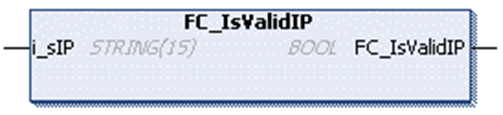

# FC\_IsValidIP

## Overview

|  |  |
| --- | --- |
| Type | Function |
| Available as of | V1.0.4.0 |
| Inherits from | - |
| Implements | - |

## Task

Determine whether the given string is a valid IPv4 address.

## Functional Description

This function determines whether the given string is a valid IPv4 address.

## Interface

| Input | Data type | Description |
| --- | --- | --- |
| i\_sIP | STRING(15) | String to be verified. |

## Return Value

| Data type | Description |
| --- | --- |
| BOOL | TRUE if the given string is a valid IPv4 address, FALSE otherwise. |

EIO0000002803.07