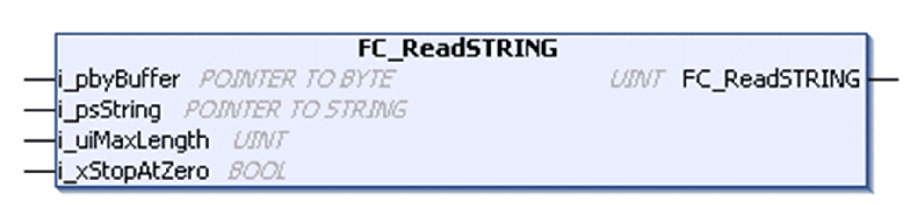

# FC\_ReadSTRING

## Overview

|  |  |
| --- | --- |
| Type | Function |
| Available as of | V1.0.4.0 |
| Inherits from | - |
| Implements | - |

## Task

Copy characters stored in any data type into a variable of type STRING.

## Functional Description

With the use of this function, potentially received ASCII characters can be copied from the receive buffer into a variable of type STRING.

The data source of any data type is passed to the function with the use of a pointer through the input i\_pbyBuffer. The destination for the data, the variable of type STRING, is passed to the function with the use of a pointer through the input i\_psString. The maximum number of characters to be copied is determined through the input i\_uiMaxLength.

Through the input i\_xStopAtZero, it is determined whether the function copies all bytes specified by i\_uiMaxLength or if the copying process stops at the first NUL character (16#0) detected. Note that the NUL character indicates the end of the value of a variable of type STRING.

If no NUL character is detected until the maximum number of characters are copied or the input i\_xStopAtZero is FALSE, the function will write the NUL character into the nth byte of the destination memory. n = i\_uiMaxLength +1. This is, the maximum value of i\_uiMaxLength equals to the size of the destination memory - 1.

NOTE: To prevent access violation caused by invalid pointer access (out of bounds) to the memory, use the arithmetic operator SIZEOF in conjunction with the destination memory to determine the value for i\_uiMaxLength.

## Coding Example

Coding example for the use of the FC\_ReadSTRING in structured text:

// copy the data into a variable of type STRING

`TCPUDP.FC_ReadSTRING(`

`i_pbyBuffer := ADR(abyReceiveBuffer),`

`i_psString := ADR(sData),`

`i_uiMaxLength := SIZEOF(sData)-1,`

`i_xStopAtZero := TRUE);`

## Interface

| Input | Data type | Description |
| --- | --- | --- |
| i\_pbyBuffer | POINTER TO BYTE | Pointer to memory address to be copied from (source). |
| i\_psString | POINTER TO STRING | Pointer to memory address to be copied to (destination, a variable of type STRING) |
| i\_uiMaxLength | UINT | Maximum number of bytes to be copied. |
| i\_xStopAtZero | BOOL | If TRUE, the copying process stops when the first NUL character (16#0) was detected. If FALSE the number of bytes specified with i\_uiMaxLength and one NUL character are written into the destination memory. |

## Return Value

| Data type | Description |
| --- | --- |
| UINT | Number of bytes written into the destination memory. |

EIO0000002803.07