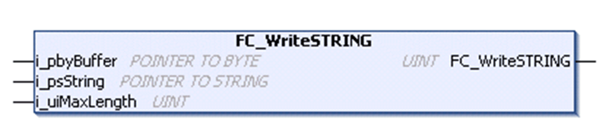

# FC\_WriteSTRING

## Overview

|  |  |
| --- | --- |
| Type | Function |
| Available as of | V1.0.4.0 |
| Inherits from | - |
| Implements | - |

## Task

Copy characters stored from a variable of type STRING into a buffer of any data type.

## Functional Description

With the use of this function the value of a variable of type STRING can be copied into the send buffer of any data type.

The data source, the variable of type STRING, is passed with the use of a pointer through the input i\_psString. The destination for the data, a buffer of any data type, is passed to the function with the use of a pointer through the input i\_pbyBuffer. The maximum number of characters to be copied is determined through the input i\_uiMaxLength.

If the length of the value of the variable of type STRING is less than the value of i\_uiMaxLength, the function stops the copying process when the first NUL character (16#0) is detected. Note that the NUL character indicates the end of the value of a variable of type STRING. If the length is greater than the value of i\_uiMaxLength, the maximum number of bytes is copied and the last byte is overwritten with 16#0 in the buffer.

NOTE: To prevent access violation caused by invalid pointer access (out of bounds) to the memory, use the arithmetic operator SIZEOF in conjunction with the targeted buffer to determine the value for i\_uiMaxLength.

## Coding Example

Coding example for the use of the `FC_WriteSTRING` in structured text:

// copy the value of the variable of type STRING into the buffer

`TCPUDP.FC_WriteSTRING(`

`i_pbyBuffer := ADR(abySendBuffer),`

`i_psString := ADR(sData),`

`i_uiMaxLength := SIZEOF(abySendBuffer);`

## Interface

| Input | Data type | Description |
| --- | --- | --- |
| i\_pbyBuffer | POINTER TO BYTE | Pointer to memory address to be copied to destination memory. |
| i\_psString | POINTER TO STRING | Pointer to memory address to be copied from (source variable of type STRING). |
| i\_uiMaxLength | UINT | Maximum number of bytes to be copied. |

## Return Value

| Data type | Description |
| --- | --- |
| UINT | Number of bytes written into destination memory. |

EIO0000002803.07