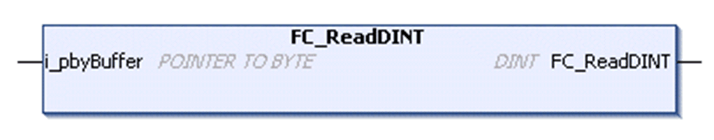

# FC\_Read<Data type>

## Overview

|  |  |
| --- | --- |
| Type | Function |
| Available as of | V1.0.4.0 |
| Inherits from | - |
| Implements | - |

Example FC\_ReadDINT

## Task

Read a value from a buffer, convert it to the byte order of the controller, and return it as the special data type.

## Functional Description

The function reads the value from a buffer, expected in network byte order, converts it to the byte order of the controller and returns it as the special data type <Data type>.

## Functions Available

The following functions are available for the different data types:

| Function | Data type |
| --- | --- |
| FC\_ReadDINT | DINT |
| FC\_ReadINT | INT |
| FC\_ReadSINT | SINT |
| FC\_ReadUDINT | UDINT |
| FC\_ReadUINT | UINT |
| FC\_ReadUSINT | USINT |

## Interface

| Input | Data type | Description |
| --- | --- | --- |
| i\_pbyBuffer | POINTER TO BYTE | Start address of the buffer to read. |

## Return Value

| Data type | Description |
| --- | --- |
| <Data type> (see table above) | Value in <Data type>. |

EIO0000002803.07