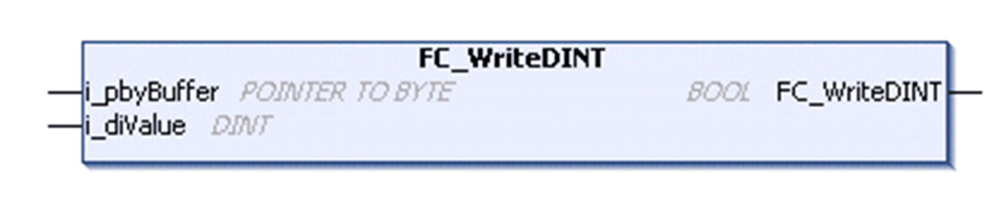

# FC\_Write<Data type>

## Overview

|  |  |
| --- | --- |
| Type | Function |
| Available as of | V1.0.4.0 |
| Inherits from | - |
| Implements | - |

Example FC\_WriteDINT

## Task

Write the value in the special data type into the expected in network byte order to the buffer.

## Functional Description

The function writes the value in the special <Data type> into the expected in network byte order to the buffer and returns TRUE if it is done.

## Functions Available

The following functions are available for the different data types:

| Function | Data type |
| --- | --- |
| FC\_WriteDINT | DINT |
| FC\_WriteINT | INT |
| FC\_WriteSINT | SINT |
| FC\_WriteUDINT | UDINT |
| FC\_WriteUINT | UINT |
| FC\_WriteUSINT | USINT |

## Interface

| Input | Data type | Description |
| --- | --- | --- |
| i\_pbyBuffer | POINTER TO BYTE | Start address of the buffer to write the value. |
| i\_<Data type>Value  (for example i\_diValue for FC\_WriteDINT) | <Data type> (see table above) | Value in the special data type. |

## Return Value

| Data type | Description |
| --- | --- |
| BOOL | TRUE if done. |

EIO0000002803.07