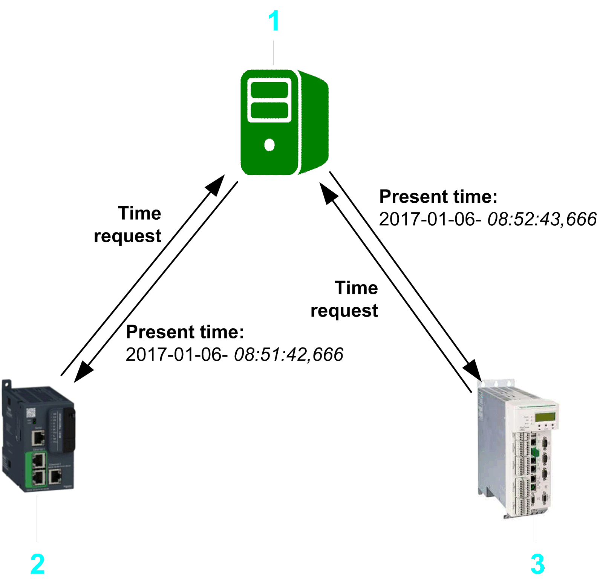

# Library Overview

Library Overview

The TimeSync library implements the [SNTP](../glossary/glossary.htm#XREF_D_SE_0024697_818) (Simple Network Time Protocol) client feature. It allows your controller to connect to an NTP (Network Time Protocol) or SNTP time server in order to synchronize the internal [RTC](../glossary/glossary.htm#XREF_D_SE_0024697_729) (Real-Time Clock) of the controller in accordance with the primary time standard [UTC](../glossary/glossary.htm#XREF_D_SE_0024697_483) (Universal Time Coordinated) that is globally unique.

The [SNTP](../glossary/glossary.htm#XREF_D_SE_0024697_818) client complies to version 4 of the [SNTP](../glossary/glossary.htm#XREF_D_SE_0024697_818) protocol.

It provides the following functions:

oGenerating a request to an (S)NTP server

oReceiving and structuring the response of the (S)NTP server

oCalculating the round-trip delay and the clock offset

oProviding the synchronized time stamp for synchronizing the [RTC](../glossary/glossary.htm#XREF_D_SE_0024697_729) of the controller and taking the offset between local RTC and (S)NTP server time as well as round-trip delay times into account

oManaging detected errors

1   Time server: SNTP or NTP server

2   Controller X: SNTP client

3   Controller Y: SNTP client