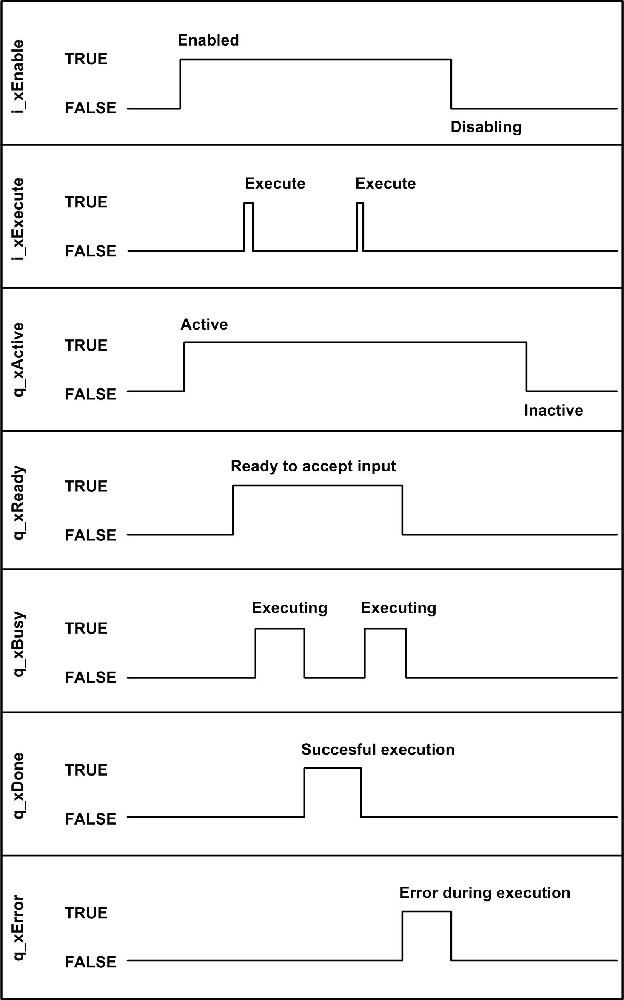

# Functional Description

Functional Description

The FB\_SntpClient function block is the user interface for SNTP communications.

The function block needs to be enabled and ready to perform a request. When starting the execution of a request, the information from the inputs is used to build an [SNTP](../glossary/glossary.htm#XREF_D_SE_0024697_818) telegram containing the time request. The telegram is sent to a single server using [UDP](../glossary/glossary.htm#XREF_D_SE_0024697_91).

The function block waits for a response from the server, processes it and presents the received information at the output q\_stTimeResponse. As long as the function block is executing a request, the output q\_xBusy is set to TRUE and q\_etResult presents the state of operation. The output q\_xDone indicates a successful execution and q\_xError shows if the function block detects an error during execution with q\_etResult and q\_sResultMsg presenting further information on the nature or cause of the detected error. If an error is detected, the function block needs to be reset by disabling and re-enabling it.

Depending on the input i\_xSyncRtc, the calculated values are used to set the [RTC](../glossary/glossary.htm#XREF_D_SE_0024697_729) of the controller to the value that has been received from the server (including the offset defined with the input i\_diTimeZone). A maximum accuracy of 1 s can be reached for [UTC](../glossary/glossary.htm#XREF_D_SE_0024697_483) synchronization.

NOTE: Daylight saving time is not taken into account by the function block. You have to take appropriate measures in your application. Also refer to the RTC Control / Timezone / Daylight Saving Time Example Guide [document](../front/front-4.htm#XREF_D_SE_0081055_12).

The input i\_uiMaxRtcOffset can be used as a plausibility check to verify the results from the server before the [RTC](../glossary/glossary.htm#XREF_D_SE_0024697_729) of the controller is set.

NOTE: Setting the RTC of the controller generates entries into the controller log file. Therefore, for automatic adjustments, do not use this function more than once a day.

