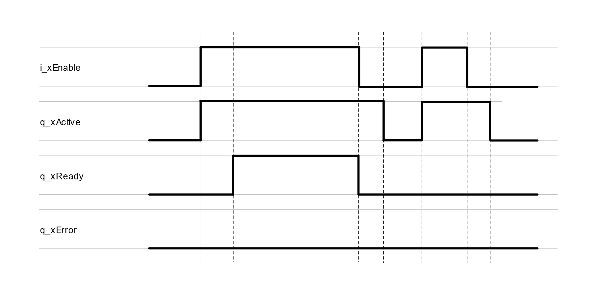
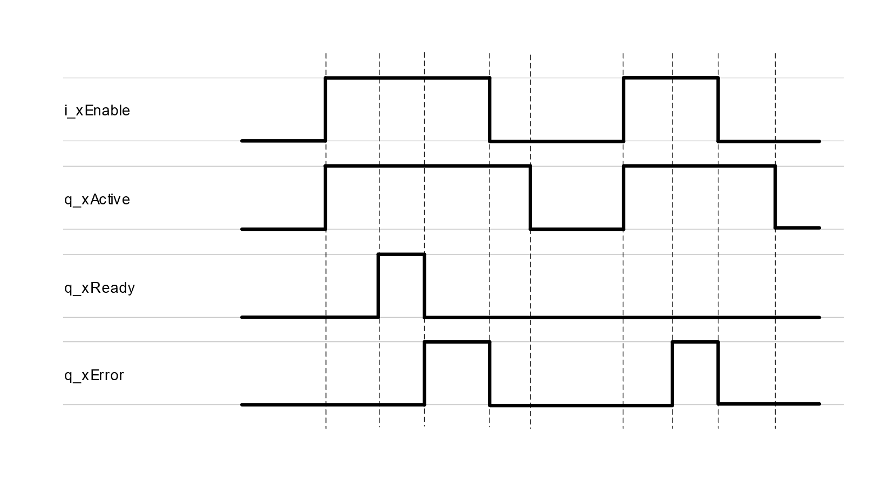
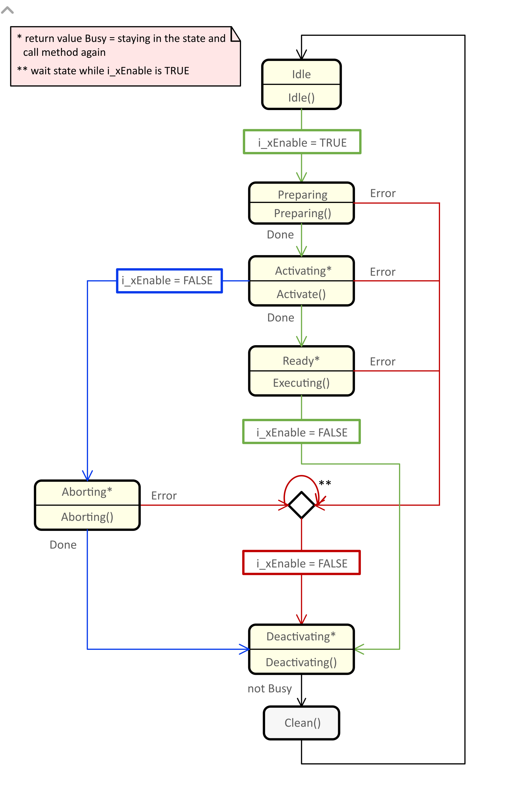

# FB\_EnableReady

## Overview

|  |  |
| --- | --- |
| Type: | Function block |
| Available as of: | V1.0.4.0 |

## Functional Description

The function block FB\_EnableReady provides the common behavior and the common inputs and outputs for implementing a function block, according to the definition for binding a resource. The resource is bound as long as the function block is enabled.

By setting the input i\_xEnable to TRUE, the function block starts the enabling process. The function block continues initialization and the output q\_xActive is set to TRUE. Once the initialization is finished, the output q\_xReady is set to TRUE.

If an error is detected, the output q\_xReady is set to FALSE and the output q\_xError is set to TRUE. The output q\_xError remains TRUE until the function block is disabled.

## Interface

| Input | Data type | Description |
| --- | --- | --- |
| i\_xEnable | BOOL | The function block is activating. |

| Output | Data type | Description |
| --- | --- | --- |
| q\_xActive | BOOL | If the function block is active, this output is set to TRUE. |
| q\_xReady | BOOL | If the initialization is successful, this output is set to TRUE. |
| q\_xError | BOOL | If this output is set to TRUE, an error has been detected. |

## Signal Diagrams

Signal diagram during successful execution:

Signal diagram when an error has been detected:

## State Machine Diagram

The state machine diagram illustrates the procedures, methods, states and state transitions that are defined for this function block.

* For a legend describing the elements of the state machine diagram, refer to [Legend of State Machine Diagrams](StateMachTPC-D1DD728B.html).
* For further information on the methods implemented, refer to the chapter [Methods](Methods-D1D36675.html).

EIO0000004561.00