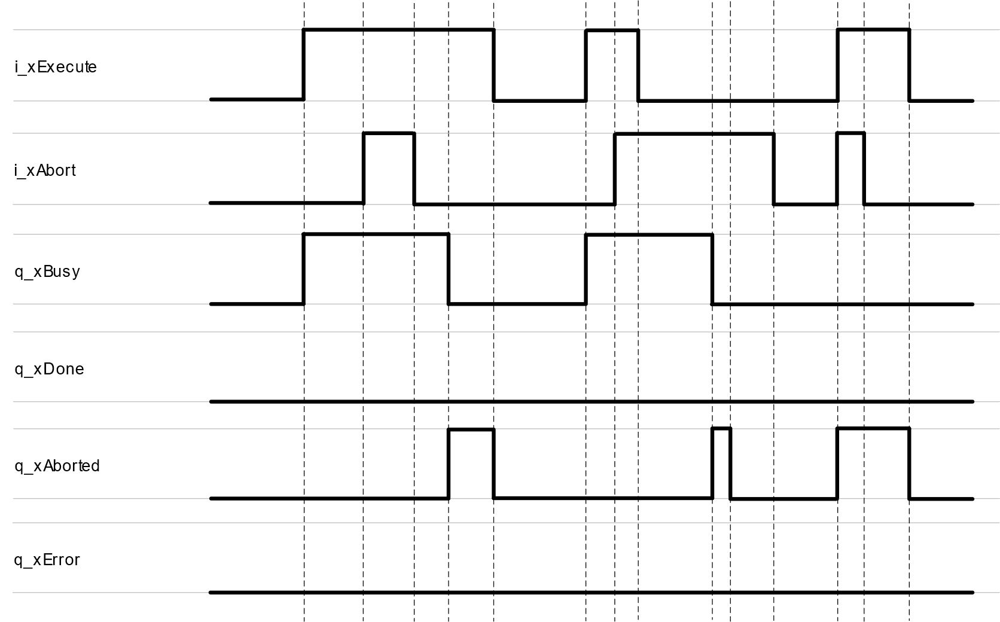
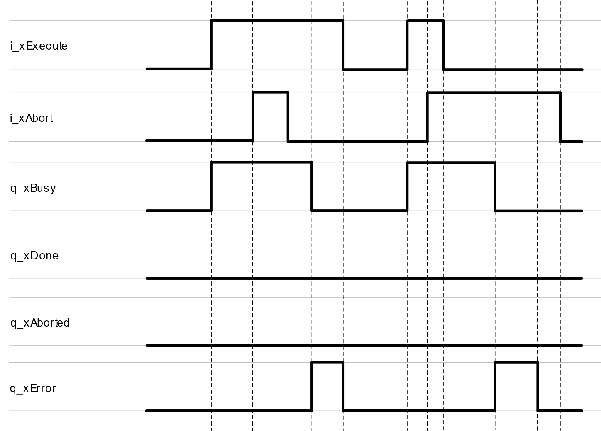
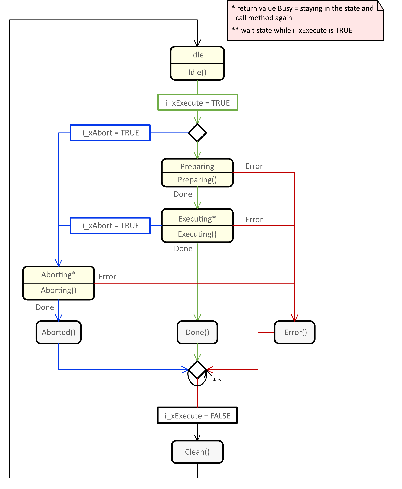

# FB\_ExecuteAbort

## Overview

|  |  |
| --- | --- |
| Type: | Function block |
| Available as of: | V1.0.4.0 |

## Functional Description

The function block FB\_ExecuteAbort provides the common behavior and the common inputs and outputs for implementing a function block, according to definition used for tasks that are executed once with a defined final state and the possibility to abort the ongoing execution.

A rising edge of the input i\_xExecute starts the execution of the function block. The function block continues execution and the output q\_xBusy is set to TRUE. A rising edge of the input i\_xExecute is ignored while the function block is being executed.

A rising edge of the input i\_xAbort aborts the execution of the function block. As soon as the abort procedure has been finished, the output q\_xAborted is set to TRUE.

Once the execution or abort procedure is finished, one of the outputs q\_xDone, q\_xError or q\_xAborted remains TRUE until the input i\_xExecute is set to FALSE. If the input is reset before the execution is finished, the output q\_xDone, q\_xError or q\_xAborted is set to TRUE for one cycle. One cycle indicates the period until the next call of the function block.

## Interface

| Input | Data type | Description |
| --- | --- | --- |
| i\_xExecute | BOOL | A rising edge of this input starts the execution of the function block. |
| i\_xAbort | BOOL | A rising edge of this input aborts the execution of the function block. |

| Output | Data type | Description |
| --- | --- | --- |
| q\_xBusy | BOOL | If this output is set to TRUE, the function block execution is in progress. |
| q\_xDone | BOOL | If this output is set to TRUE, the execution has been completed successfully. |
| q\_xAborted | BOOL | If this output is set to TRUE, the execution has been aborted. |
| q\_xError | BOOL | If this output is set to TRUE, an error has been detected. |

The function block FB\_ExecuteAbort provides the properties timTimeout and xTimeoutExpired. For a description, refer to the chapter [Properties](CommonProperties-D16AE390.html).

## Signal Diagrams

The signal diagram for successful execution is identical with the signal diagram during successful execution of the [function block FB\_Execute](FB_Execute-CC2D4D73.html#FB_Execute-CC2D4D73__SignalDiagrams-CC2D98DF).

Signal diagram for successfully aborting the ongoing execution:

Signal diagram for detecting an error while aborting the ongoing execution:

## State Machine Diagram

The state machine diagram illustrates the procedures, methods, states and state transitions that are defined for this function block.

* For a legend describing the elements of the state machine diagram, refer to [Legend of State Machine Diagrams](StateMachTPC-D1DD728B.html).
* For further information on the methods implemented, refer to the chapter [Methods](Methods-D1D36675.html).

EIO0000004561.00