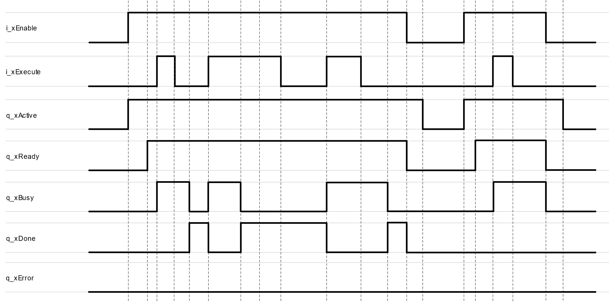
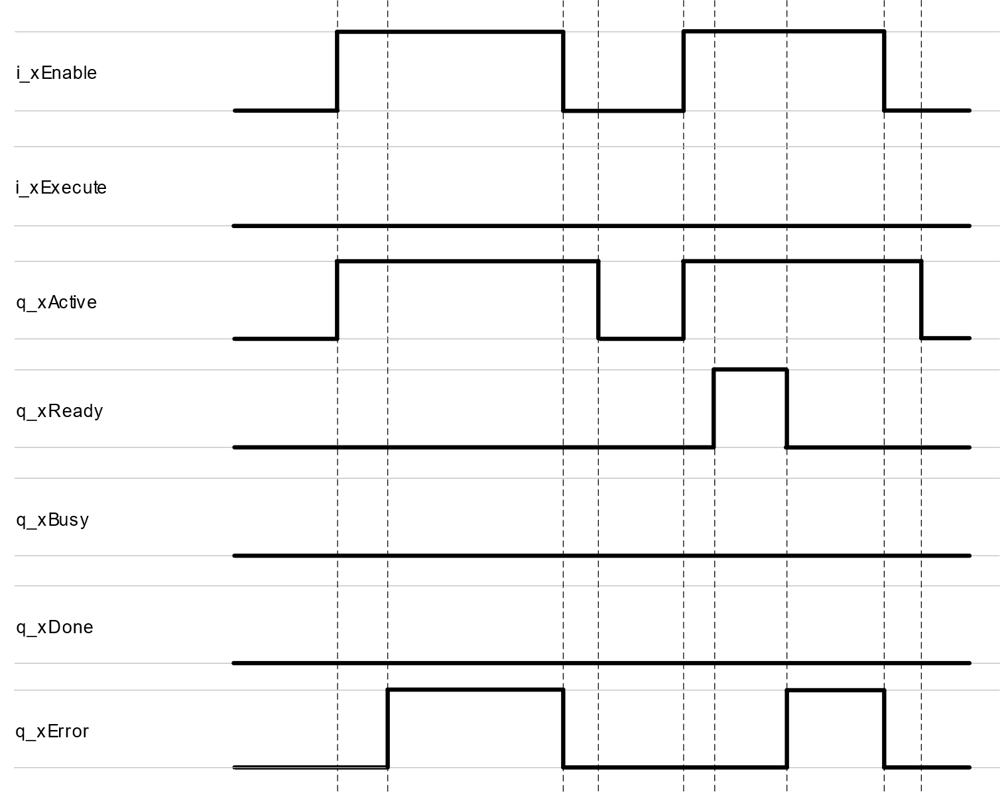
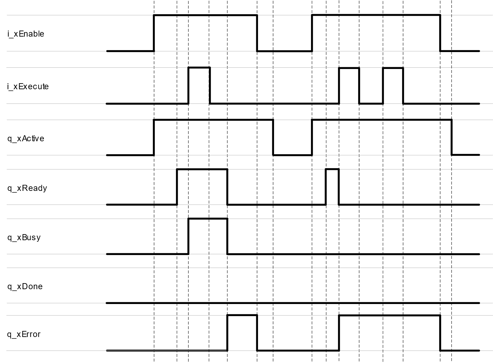
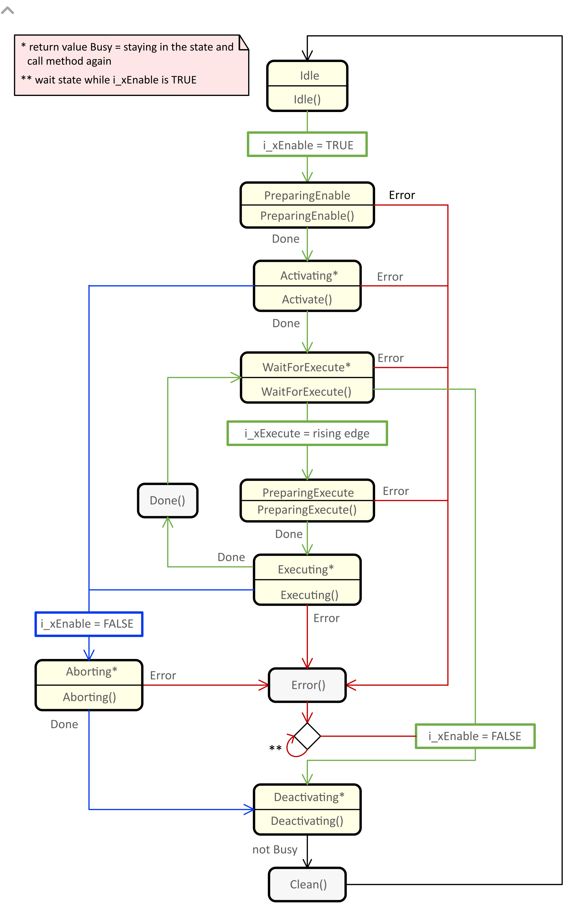

# FB\_EnableExecute

## Overview

|  |  |
| --- | --- |
| Type: | Function block |
| Available as of: | V1.0.4.0 |

## Functional Description

The function block FB\_EnableExecute is a combination of the function blocks FB\_EnableReady and FB\_Execute.

By setting the input i\_xEnable to TRUE, the function block starts the enabling process. The function block continues initialization and the output q\_xActive is set to TRUE. Once the initialization is finished and the function block is ready, the output q\_xReady is set to TRUE.

A rising edge of the input i\_xExecute starts the execution of the function block. The function block continues execution and the output q\_xBusy is set to TRUE. A rising edge at the input i\_xExecute is ignored while the output q\_xReady is FALSE or the function block is being executed.

Once the execution is finished, the output q\_xBusy is set to FALSE and the output q\_xDone or q\_xError is set to TRUE according to the result.

The output q\_xDone indicates a successful execution and remains TRUE until the next rising edge of the input i\_xExecute.

In case an error is detected, the output q\_xReady is set to FALSE and the output q\_xError is set to TRUE. The function block must be disabled in order to acknowledge the error state.

By setting the input i\_xEnable to FALSE, the function block starts the disabling process. The function block must be called as long as the output q\_xActive is TRUE.

## Interface

| Input | Data type | Description |
| --- | --- | --- |
| i\_xEnable | BOOL | Activation and initialization of the function block. |
| i\_xExecute | BOOL | A rising edge of this input starts the execution of the function block. |

| Output | Data type | Description |
| --- | --- | --- |
| q\_xActive | BOOL | If the function block is active, this output is set to TRUE. |
| q\_xReady | BOOL | If the initialization is successful, the output is set to TRUE. |
| q\_xBusy | BOOL | If this output is set to TRUE, the function block execution is in progress. |
| q\_xDone | BOOL | If this output is set to TRUE, the execution has been completed successfully. |
| q\_xError | BOOL | If this output is set to TRUE, an error has been detected. |

## Signal Diagrams

Signal diagram during successful execution:

Signal diagram when an error has been detected while enabling:

Signal diagram when an error has been detected while executing:

## State Machine Diagram

The state machine diagram illustrates the procedures, methods, states and state transitions that are defined for this function block.

* For a legend describing the elements of the state machine diagram, refer to [Legend of State Machine Diagrams](StateMachTPC-D1DD728B.html).
* For further information on the methods implemented, refer to the chapter [Methods](Methods-D1D36675.html).

EIO0000004561.00