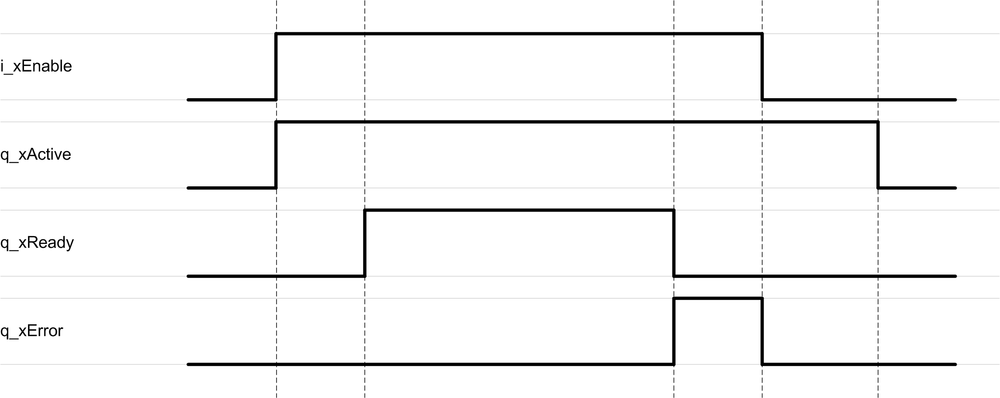

# Behavior of Function Blocks with the Input i\_xEnable

## General Information

By setting the input i\_xEnable to TRUE, the function block starts the enabling process. The function block continues initialization and the output q\_xActive is set to TRUE. Once the initialization is finished, the output q\_xReady is set to TRUE.

In case an error is detected, the output q\_xError remain TRUE until the function block is disabled.

## Example

EIO0000004219.05