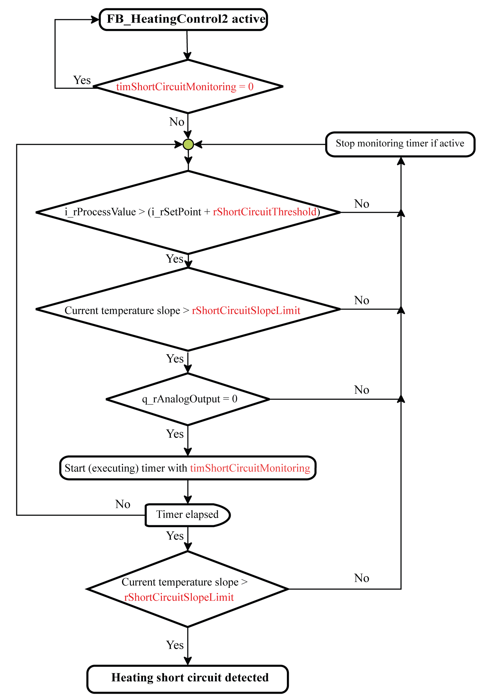
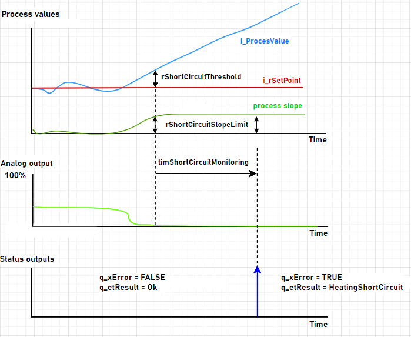
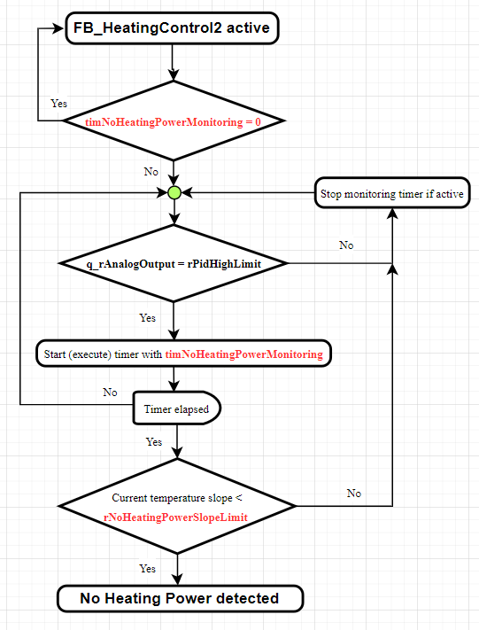
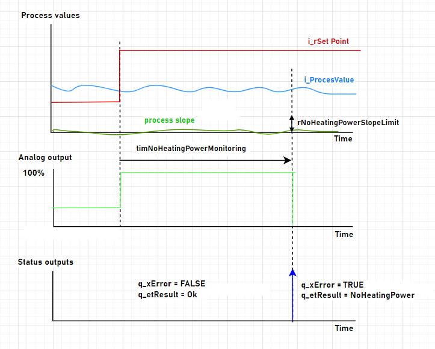
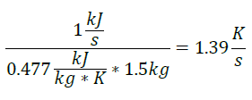

# ST\_HeatingSystemMonitoring

## Overview

|  |  |
| --- | --- |
| Type: | Structure |
| Available as of: | V1.2.3.0 |

## Description

The structure ST\_HeatingSystemMonitoring provides parameters for monitoring and controlling the heating system for FB\_HeatingControl2.

## Structure Elements

| Name | Data type | Description |
| --- | --- | --- |
| xAutomaticCalculation | BOOL | If this value is TRUE, the values for rShortCircuitThreshold, rShortCircuitSlopeLimit and rNoHeatingPowerSlopeLimit are calculated with each auto-tuning and are overwritten.  Default value: TRUE |
| timShortCircuitMonitoring | TIME | Time period in seconds.  If this time has elapsed, a test is performed verifying whether a short circuit of the heating has occurred.  To disable short circuit monitoring, select 0.  Range: 0 or 10…600  Default value: 30 |
| rShortCircuitThreshold | REAL | Value in [°C] which, together with the set point, defines the temperature (i\_rSetpoint + rShortCircuitThreshold) that activates the short circuit test.  When xAutomaticCalculation is set to TRUE, the value is calculated automatically and is overwritten.  For auto-tuning, select a minimum value of 5.  Range: 1…30  Default value: 15 |
| rShortCircuitSlopeLimit | REAL | Maximum permissible slope of the temperature in [°C/s]. Defines the upper threshold value above which the short circuit verification of the heating is activated. The value must not be exceeded after the monitoring time has elapsed.  When xAutomaticCalculation is set to TRUE, the value is calculated automatically and is overwritten.  Range: 0.1…5.0  Default value: 0.5 |
| timNoHeatingPowerMonitoring | TIME | Time period in seconds.  If this time has elapsed, a test of the heating power is performed.  To disable system heating power monitoring, select 0.  Range: 0 or 10…600  Default value: 60 |
| rNoHeatingPowerSlopeLimit | REAL | Minimum expected slope of the temperature in [°C/s]. Defines the lower threshold value that must be reached when the heating is controlled (q\_rAnalogOutput = rPidHighLimit).  When xAutomaticCalculation is set to TRUE, the value is calculated automatically and is overwritten.  Range: 0.1...5.0  Default value: 0.1 |

NOTE: The parameters are not saved permanently. This means that these parameters need to be re-established after each controller power cycle. The application needs to handle them, for example, by saving into a file or declaring as retained.

## Short Circuit Monitoring

The three parameters rShortCircuitThreshold, rShortCircuitSlopeLimit and timShortCircuitMonitoring allow you to configure short circuit monitoring of the heating.

If short circuit monitoring of the heating is activated by setting the parameter timShortCircuitMonitoring to a value greater than or equal to 30, the following conditions are verified in the background:

* The value of i\_rProcessValue must be greater than the sum of the inputs i\_rSetPoint plus rShortCircuitThreshold
* The temperature slope must be greater than the slope limit value rShortCircuitSlopeLimit
* The analog output q\_rAnalogOutput must be equal to 0 %

If all conditions are met, the timer defined with timShortCircuitMonitoring is started.

After the timShortCircuitMonitoring time has elapsed and the temperature slope is still greater than rShortCircuitSlopeLimit, a diagnostic message is generated and the output q\_xError is set to TRUE.

As soon as one of the preconditions is no longer fulfilled, the timer is stopped and reset.

The following figure provides an overview of the process with process variables:

## Heating Power Monitoring

The parameters rNoHeatingPowerSlopeLimit and timNoHeatingPowerMonitoring allow you to configure monitoring of the heating with regard to unavailable system heating power, for example, caused by a cable break or inoperable relay.

If monitoring for unavailable system heating power is activated by setting the parameter timNoHeatingPowerMonitoring to a value greater than zero, it is verified in the background whether the heating power q\_rAnalogOutput is equal to the maximum limit rPidHighLimit.

If this precondition is met, the timer defined with timNoHeatingPowerMonitoring is started.

After the timNoHeatingPowerMonitoring time has elapsed and the process value slope is less than rNoHeatingPowerSlopeLimit, a diagnostic message is generated and the output q\_xError is set to TRUE.

As soon as one of the preconditions is no longer fulfilled, the timer is stopped and reset.

The following figure provides an overview of the process with process variables:

## Calculating Heating System Monitoring Variables

As described in the previous paragraphs, the parameters rShortCircuitThreshold, rShortCircuitSlopeLimit and rNoHeatingPowerSlopeLimit can be setup automatically during auto-tuning. For this purpose, the maximum temperature and the largest temperature gradient are determined internally. The following is valid:

* rShortCircuitThreshold = (maximum temperature reached during auto-tuning - i\_rSetPoint)

  if rShortCircuitThreshold < 5 °C, then rShortCircuitThreshold = 5 °C
* rSchortCircuitSlopeLimit = 0.66 \* largest temperature slope during auto-tuning
* rNoHeatingPowerSlopeLimit = 0.2 \* largest temperature slope during auto-tuning

Alternatively, the values can also be determined based on the parameters of the heating system. The following example is based on a heating system with the following characteristics:

* Material = steel with a specific heat capacity of 0.477 kJ/(kg\*K)
* Mass = 1.5 kg
* Maximum power = 1000 W

Follows from this:

The maximum slope with 100 % heating power (rPidHighLimit = 100) is about 1.4 °C/s. This value is the basis for determining the values of rShortCircuitThreshold, rShortCircuitSlopeLimit and rNoHeatingPowerSlopeLimit. Use the monitoring times timShortCircuitMonitoting and timNoHeatingPowerMonitoring to configure the time an overshoot or undershoot of these limit values is allowed.

EIO0000004219.05