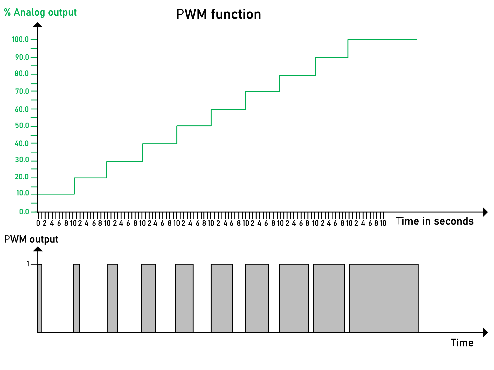
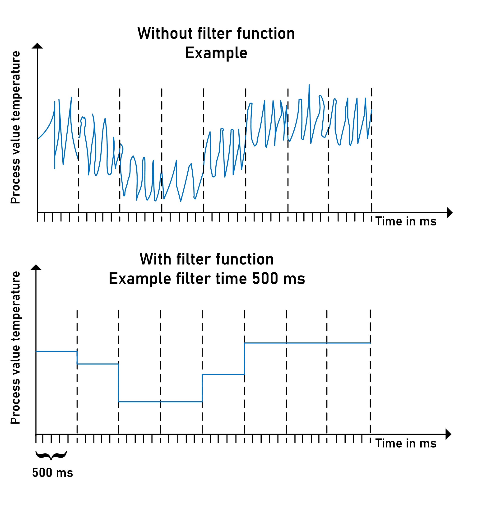
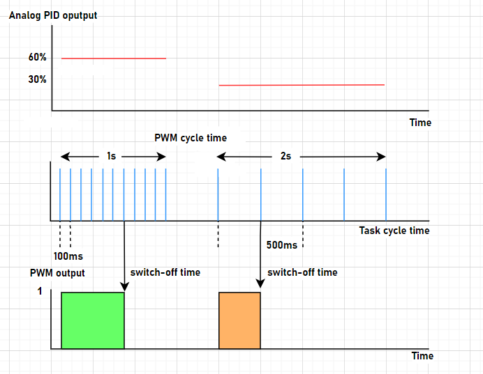

# ST\_TemperatureControl2

## Overview

|  |  |
| --- | --- |
| Type: | Structure |
| Available as of: | V1.2.3.0 |

## Description

The structure ST\_TemperatureControl2 provides various parameters needed for the temperature control function block ([FB\_HeatingControl2](FB_HeatingControl2-771217B0.html)).

## Structure Elements

| Name | Data type | Description |
| --- | --- | --- |
| rSetPointHighLimit | REAL | High limit for set point. Also refer to [rSetPointHighLimit, rSetPointLowLimit](#ST_TemperatureControl2-6CD77514__RSetPointHighLimitRSetPointLowLimit-6CD869D4).  Range:  -100 °C < rSetPointHighLimit ≤ 800 °C  rSetPointHighLimit > rSetPointLowLimit  Default value: 100 °C  NOTE: Adjust the set point range to the requirements of the heating system and the working range of your application. |
| rSetPointLowLimit | REAL | Low limit for set point. Also refer to [rSetPointHighLimit, rSetPointLowLimit](#ST_TemperatureControl2-6CD77514__RSetPointHighLimitRSetPointLowLimit-6CD869D4).  Range:  -100 °C ≤ rSetPointLowLimit < 800 °C  rSetPointLowLimit < rSetPointHighLimit  Default value: 0 °C  NOTE: Adjust the set point range to the requirements of the heating system and the working range of your application. |
| rPidHighLimit | REAL | High limit for the internal PID controller output. Also refer to [rPidLowLimit, rPidHighLimit](#ST_TemperatureControl2-6CD77514__RPidLowLimitRPidHighLimit-6CD85B38).  Range:  Heating: rPidLowLimit < rPidHighLimit ≤ 100 %  Default value: 100 % |
| rPidLowLimit | REAL | Low limit for the internal PID controller output. Also refer to [rPidLowLimit, rPidHighLimit](#ST_TemperatureControl2-6CD77514__RPidLowLimitRPidHighLimit-6CD85B38).  Range:  Heating: = 0 % ≤ rPidLowLimit < rPidHighLimit  Default value: 0.0 % |
| rPwmTimePeriod | REAL | Time period for the PWM (Pulse-Width Modulation) signal in [s]. Also refer to [rPwmTimePeriod](#ST_TemperatureControl2-6CD77514__RPwmTimePeriod-6CD864A9).  This value scales the output q\_rAnalogOutput to the PWM output q\_xPwmOutput.  Range: 0.1...60 s  Default value: 1 s  NOTE: The least value that can be set depends on the cycle time with which the function block is called. The value of rPwmTimePeriod must be greater than the cycle time by at least the factor uiPwmCycleTimeToTaskRatio. For example, with a determined cycle time of 50 ms and a uiPwmCycleTimeToTaskRatio of 10, a value range of 0.5 s...60 s is allowed.  The accuracy of the PWM output q\_xPwmOutput on-time related to rPwmTimePeriod to the analog value q\_rAnalogOutput depends both on the cycle time of the task as well as on the rPwmTimePeriod. q\_xPwmOutput can be switched on/off with each task cycle. Thus, the total ratio of (q\_xPwmOutput on-time / rPwmTimePeriod) is closer to the q\_rAnalogOutput value the less the cycle time of the task and the greater the value of rPwmTimePeriod.  On the other hand, with the same q\_rAnalogOutput value, the q\_xPwmOutput Boolean value is TRUE for a longer time the greater the value of rPwmTimePeriod.  Example: If q\_rAnalogOutput = 50 % => On / off-time of q\_xPwmOutput = 5 s if rPwmTimePeriod = 10 s |
| rDigitalFilterTime | REAL | Filter time of the digital filter (noise reduction) in [ms]. Also refer to [rDigitalFilterTime](#ST_TemperatureControl2-6CD77514__RDigitalFilterTime-6CD86F8C).  If no value is given, the filter is not activated. A value less than the (determined) cycle time is not allowed.  Range: 0...100000 ms  Default value: 0 ms |
| uiPwmCycleTimeToTaskRatio | UINT | Specifies the minimum ratio of the task cycle time to [rPwmTimePeriod](#ST_TemperatureControl2-6CD77514__RPwmTimePeriod-6CD864A9). If the ratio is lower than 1 or greater than 100, a diagnostic message is issued.  Range: 1…100  Default value: 1  NOTE: The accuracy of the PWM mark-to-space ratio is greater the greater the set PWM time (rPwmTimePeriod) is in relation to the determined cycle time. |

## rPidLowLimit, rPidHighLimit

The values at these pins define the range of PID output. These values are configured as per the analog output module specification. The range is 0...100 %.

## rPwmTimePeriod

**Example:**

rPwmTimePeriod := 10 s, rPidHighLimit := 100 %, rPidLowLimit: = 0 %, q\_rAnalogOutput := 10.95 %

* PWM time on := 1,095 s
* PWM time off := 8,905 s

## rSetPointHighLimit, rSetPointLowLimit

These values determine the range of i\_rSetpoint. These values are decided with the minimum and maximum temperature which can be applied to the process so that it stops the temperature from increasing or decreasing then the desired limits.

## rDigitalFilterTime

If you get a noisy signal of the process value, you have to set the digital filter time. The filter is active when the digital filter time is greater than 0 ms. When the digital filter time is set, you get the medium process value for the entered digital filter time.

## PWM Working Principles

Pulse-width modulation (PWM) in this case is a method of controlling the average power delivered by the analog PID controller output signal. The average value provided to the load is controlled by switching the power supply of a heating system between 0 and 100% at a rate faster than it takes the load to change significantly. The longer the switch is on, the higher the total power supplied to the load.

Consider the following while determining the value for rPwmTimePeriod:

* A value that is too great for the application can lead to oscillations in the load.
* An insufficient value can lead to premature wear of the mechanical control components, for example, when using a mechanical relay.
* Consider the given task cycle time: an insufficient rPwmTimePeriod to task cycle time ratio can lead to analog values not being displayed correctly.

The orange example in the figure indicates an analog value of 30 % which results in a duty cycle of 666 ms on. Since the internal timer is evaluated every 500 ms, this duty cycle is not feasible. To avoid providing too much energy to the system and reduce temperature control deviation around the set point value that can result in a long-term impact, a total duty cycle of 500 ms is applied. Thus, 22 % are provided instead of the required 30 %. The residual value (166 ms) is added up internally with each cycle and is automatically compensated.

It is a good practice to configure a value for rPwmTimePeriod that is significantly greater than the task cycle time. Use the factor uiPwmCycleTimeToTaskRatio to set the minimum ratio (distance).

EIO0000004219.05