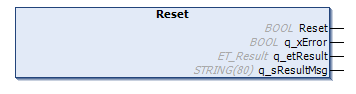

# Reset (Method)

## Overview

|  |  |
| --- | --- |
| Type: | Method |
| Available as of: | V1.2.9.0 |

## Task

Clears the stack and resets the value counter.

## Description

The method Reset clears the stack and resets the value counter specified by the property uiCount.

## Interface

| Output | Data type | Description |
| --- | --- | --- |
| q\_xError | BOOL | Indicates with TRUE that an error has been detected. For details, refer to q\_etResult and q\_etResultMsg. |
| q\_etResult | [ET\_Result](D-SE-0105329.html#D-SE-0105329) | Provides diagnostic and status information as an enumeration value. |
| q\_sResultMsg | STRING [80] | Provides additional diagnostic and status information as a text message. |

EIO0000004219.05