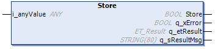

# Store (Method)

## Overview

|  |  |
| --- | --- |
| Type: | Method |
| Available as of: | V1.2.9.0 |

## Task

Adds a new value to the stack.

## Description

The method Store is used to add a new value to the stack.

NOTE: The size of the value indicated at i\_anyValue must be equal to the object size defined during instantiation of the function block. The data type of the variable assigned to the input i\_anyValue must match the data type of the object(s) already stored in the stack.

## Interface

| Input | Data type | Description |
| --- | --- | --- |
| i\_anyValue | ANY | Value to be stored inside the stack. |

| Output | Data type | Description |
| --- | --- | --- |
| q\_xError | BOOL | Indicates with TRUE that an error has been detected. For details, refer to q\_etResult and q\_etResultMsg. |
| q\_etResult | [ET\_Result](D-SE-0105329.html#D-SE-0105329) | Provides diagnostic and status information as an enumeration value. |
| q\_sResultMsg | STRING [80] | Provides additional diagnostic and status information as a text message. |

## Troubleshooting

This table describes the possible issues and their solutions:

| Issue  Outputs of the function indicate the values | Cause | Solution |
| --- | --- | --- |
| q\_xError = TRUE  q\_etResult = SizeMismatch | The size of the variable assigned to the input i\_anyValue does not match the data type of the stored object(s). | Assign a variable to i\_anyValue with a size which is equal to the object size defined during the instantiation of the function block. |
| q\_xError = TRUE  q\_etResult = TypeMismatch | The data type of the variable assigned to the input i\_anyValue does not match the data type of the stored object(s). | The data type of the variable assigned to the input i\_anyValue must match the data type of the object(s) stored in the stack. |
| q\_xError = TRUE  q\_etResult = RegisterFull | No element can be stored as stack is full. | Perform one of the following actions:   * Retrieve a value. * Clear the stack. * Increase the stack size. |

EIO0000004219.05