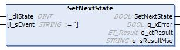

# SetNextState (Method)

## Overview

|  |  |
| --- | --- |
| Type: | Method |
| Available as of: | V1.2.9.0 |

## Task

Requests the transition to the specified state.

## Description

The method SetNextState is used to request the transition to the specified state. The state transition is performed during the next call of the Update method.

If the requested state is equal to the present state, a self-transition is requested.

A state transition that has already been requested is overwritten by calling the SetNextState method again.

## Interface

| Input | Data type | Description |
| --- | --- | --- |
| i\_diState | DINT | Specifies the state to be transitioned with the next call of the Update method. |
| i\_sEvent | STRING | Optional input to provide information about the event that caused the requested transition. The given information is part of a log message in the Application Logger as well as to a log entry of the transition logger. |

| Output | Data type | Description |
| --- | --- | --- |
| q\_xError | BOOL | Indicates with TRUE that an error has been detected. For details, refer to q\_etResult and q\_etResultMsg. |
| q\_etResult | [ET\_Result](D-SE-0105329.html#D-SE-0105329) | Provides diagnostic and status information as an enumeration value. |
| q\_sResultMsg | STRING [80] | Provides additional diagnostic and status information as a text message. |

## Troubleshooting

This table describes the possible issues and their solutions:

| Issue  Outputs of the function indicate the values | Cause | Solution |
| --- | --- | --- |
| q\_xError = TRUE  q\_etResult = NotInitialized | The finite state machine is not initialized. | Call the Update method once to initialize the finite state machine. |
| q\_xError = FALSE  q\_etResult = TransitionLoggerNotReady | The transition request was executed successfully, but logger entry could not be added to FB\_FsmTransitionLogger because there were simultaneous accesses from different tasks. | Do not simultaneously access the FB\_FiniteStateMachine from different tasks. |

EIO0000004219.05