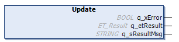

# Update (Method)

## Overview

|  |  |
| --- | --- |
| Type: | Method |
| Available as of: | V1.2.9.0 |

## Task

Performs the requested state transition.

## Description

The method Update is used to perform the requested transition. It must be called once after a warm start of the application or after a call of the Reset method to perform the initial transition of the finite state machine.

The method must be called cyclically.

## Interface

| Output | Data type | Description |
| --- | --- | --- |
| q\_xError | BOOL | Indicates with TRUE that an error has been detected. For details, refer to q\_etResult and q\_etResultMsg. |
| q\_etResult | [ET\_Result](D-SE-0105329.html#D-SE-0105329) | Provides diagnostic and status information as an enumeration value. |
| q\_sResultMsg | STRING [80] | Provides additional diagnostic and status information as a text message. |

## Troubleshooting

This table describes the possible issues and their solutions:

| Issue  Outputs of the function indicate the values | Cause | Solution |
| --- | --- | --- |
| q\_xError = FALSE  q\_etResult = TransitionLoggerNotReady | The transition request was executed successfully, but logger entry could not be added to FB\_FsmTransitionLogger because there were simultaneous accesses from different tasks. | Do not simultaneously access the FB\_FiniteStateMachine from different tasks. |

EIO0000004219.05