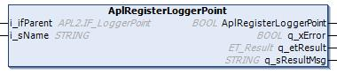

# AplRegisterLoggerPoint (Method)

## Overview

|  |  |
| --- | --- |
| Type: | Method |
| Available as of: | V1.2.9.0 |

## Task

Registers a logger point into the application logger.

## Description

With the method AplRegisterLoggerPoint, the function block FB\_FiniteStateMachine is registered as a logger point to the global Application Logger.

The name of the logger point in the Application Logger is defined by the input i\_sName.

The input i\_ifParent specifies the parent logger point under which the logger point for the function block is registered in the logger point tree.

Following successful execution of the method, the return value of the method is TRUE.

For more general information on the Application Logger, refer to the [ApplicationLogger2 Library Guide](../../../../../api/crossBook?lang=en-US&virtualBookName=APL2LG&topicID=) and to the [Menu Commands Online Help](../../../../../api/crossBook?lang=en-US&virtualBookName=SoMMenu&topicID=D_SE_0091294).

NOTE: As a prerequisite for using the AplRegisterLoggerPoint() method, the Application Logger plug-in must be added to the project and the Application Logger service must be registered.

When the logger point is registered successfully, the desired logger level must be set using the property etAplLogLevelLoggerPoint.

NOTE: The Application Logger operates independently from the FB\_FsmTransitionLogger.

The FB\_FiniteStateMachine supports the creation of log entries at the following events:

| Event | Logger Level |
| --- | --- |
| Requesting a state transition | APL2.ET\_LogLevel.StatusMessage |
| Performing a state transition | APL2.ET\_LogLevel.StatusMessage |

## Interface

| Input | Data type | Description |
| --- | --- | --- |
| i\_ifParent | APL2.IF\_LoggerPoint | The parent logger point under which the logger point of the function block is registered. The global variable APL2.GVL.G\_ifApplicationLogger is also a logger point. |
| I\_sName | STRING | The name of the logger point that is shown in the Application Logger. |

| Output | Data type | Description |
| --- | --- | --- |
| q\_xError | BOOL | Indicates with TRUE that an error has been detected. For details, refer to q\_etResult and q\_etResultMsg. |
| q\_etResult | [ET\_Result](D-SE-0105329.html#D-SE-0105329) | Provides diagnostic and status information as an enumeration value. |
| q\_sResultMsg | STRING [80] | Provides additional diagnostic and status information as a text message. |

## Troubleshooting

This table describes the possible issues and their solutions:

| Issue  Outputs of the function indicate the values | Cause | Solution |
| --- | --- | --- |
| q\_xError = TRUE  q\_etResult = InvalidInput | The value of the input i\_sName is a null string. | Assign a valid name to the input i\_sName. |
| q\_xError = FALSE  q\_etResult = LoggerPointAlreadyRegistered | The internal logger point is already registered. | The logger point is registered. Do not call the method again. |
| q\_xError = TRUE  q\_etResult = InvalidInput | The assigned logger point at the input i\_ifParent is is invalid. | A valid instance of the APL2.IF\_LoggerPoint must be assigned to the input i\_ifLoggerPoint. The global variable APL2.GVL.G\_ifApplicationLogger is also a valid logger point. |
| q\_xError = TRUE  q\_etResult = RegisterLoggerPointFailed | The logger point at the input i\_ifParent is invalid. | A valid instance of the APL2.IF\_LoggerPoint must be assigned to the input i\_ifLoggerPoint. The global variable APL2.GVL.G\_ifApplicationLogger is also a valid logger point. |
| The logger point at the input i\_ifParent is not registered in the Application Logger. | The logger point assigned to the input i\_ifParent must be registered in the Application Logger first. |
| The maximum number of logger points in the Application Logger is reached. | Increase the number of maximum logger points that can be managed by the Application Logger. |

EIO0000004219.05