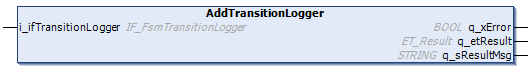

# AddTransitionLogger (Method)

## Overview

|  |  |
| --- | --- |
| Type: | Method |
| Available as of: | V1.2.9.0 |

## Task

Adds a transition logger to the finite state machine.

## Description

The method AddTransitionLogger can be used to add a transition logger to the finite state machine.

Once an instance of the IF\_FsmTransitionLogger is added to the FB\_FiniteStateMachine, the interface method AddTransition() is called whenever a transition is processed inside the function block.

NOTE: The function block FB\_FsmTranstionLogger is implementing the interface IF\_FsmTransitionLogger and can be added with this method.

NOTE: When the method is called, an already registered interface is updated. For removing an existing transition logger, call the method with the value 0 at the input i\_ ifTransitionLogger.

NOTE: The FB\_FsmTransitionLogger operates independently from the Application Logger.

## Interface

| Input | Data type | Description |
| --- | --- | --- |
| i\_ifTransitionLogger | IF\_FsmTransitionLogger | Function block implementing IF\_FsmTransitionLogger used to log transitions |

| Output | Data type | Description |
| --- | --- | --- |
| q\_xError | BOOL | Indicates with TRUE that an error has been detected. For details, refer to q\_etResult and q\_etResultMsg. |
| q\_etResult | [ET\_Result](D-SE-0105329.html#D-SE-0105329) | Provides diagnostic and status information as an enumeration value. |
| q\_sResultMsg | STRING [80] | Provides additional diagnostic and status information as a text message. |

## Troubleshooting

This table describes the possible issues and their solutions:

| Issue  Outputs of the function indicate the values | Cause | Solution |
| --- | --- | --- |
| q\_xError = TRUE  q\_etResult = NotReady | Another process is preventing the command from being executed. | Try the method again. |

EIO0000004219.05