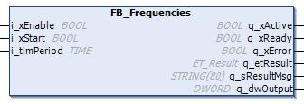

# General Information - FB\_Frequencies

## Overview

|  |  |
| --- | --- |
| Type: | Function block |
| Available as of: | V1.2.9.0 |

## Task

Implements a flashing light with differing frequencies.

## Description

The function block FB\_Frequencies implements a flashing light with differing frequencies. The input i\_xEnable activates the function block. If the function block is active, the input i\_xStart is considered. A signal TRUE at i\_xStart enables the flashing sequence of the bits of the output q\_dwOutput. The bits start with value 0. The least significant bit alternates between 0 and 1 with the period specified at the input i\_timPeriod (half of the period is 0 and another half is 1), the next higher bit with 2 x i\_timPeriod, the next higher with 4 x i\_timPeriod, and so on. Once i\_xStart is set to FALSE, the output q\_dwOutput maintains the last value.

Upon a rising edge at i\_xStart, the value of the input i\_timPeriod is latched inside the function block. Changes of the value are not taken into account while the flashing sequence is active.

During the flashing sequence, the calling intervals of the function block are monitored. If the calling interval of the function block is greater than a half of the value of i\_timPeriod, the flashing sequence is stopped and an error is indicated for the function block.

NOTE: For high accuracy of the frequencies at which the bits flash, the period divided by the call interval of the device should result in an even integer value.

Setting i\_xEnable to FALSE resets a detected error and sets the output q\_dwOutput to 0.

## Interface

| Input | Data type | Description |
| --- | --- | --- |
| i\_xEnable | BOOL | Enables the function block.  Refer to [Behavior of Function Blocks with the Input i\_xEnable](i_xEnable-145A050A.html). |
| i\_xStart | BOOL | Starts the flashing sequence at the output q\_dwOutput. |
| i\_timPeriod | TIME | Period of the frequency for the least significant bit of q\_dwOutput. |

| Output | Data type | Description |
| --- | --- | --- |
| q\_xActive | BOOL | Indicates with TRUE that the program code is executing and that it must be executed in each cycle. |
| q\_xReady | BOOL | Indicates with TRUE that the POU is ready and can be controlled via its inputs according to its functionality. |
| q\_xError | BOOL | Indicates with TRUE that an error has been detected. For details, refer to q\_etResult and q\_etResultMsg. |
| q\_etResult | [ET\_Result](D-SE-0105329.html#D-SE-0105329) | Provides diagnostic and status information as an enumeration value. |
| q\_sResultMsg | STRING [80] | Provides additional diagnostic and status information as a text message. |
| q\_dwOutput | DWORD | Output word, its bits are flashing. |

EIO0000004219.05