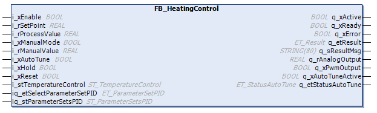

# General Information - FB\_HeatingControl

## Overview

|  |  |
| --- | --- |
| Type: | Function block |
| Available as of: | V1.0.1.0 |

## Task

The function block FB\_HeatingControl monitors and controls heating systems.

This function block is the successor of the TemperatureControl\_Easy function block which was available in the Packaging Library of SoMachine.

## Description

The function block FB\_HeatingControl is designed to monitor and control heating systems. This means that the output q\_rAnalogOutput can only have values greater than or equal to zero.

The auto-tuning algorithm is based on the so-called relay method. With this method, the process is induced by oscillations. After the completion of three oscillations, the auto-tuning calculates a set of PID parameters.

NOTE: The function block is working independent from the user-defined units, for example, °C, °F, Kelvin, mA, or mV. The application must use the same definition and resolution for the set point (i\_rSetPoint) and the process value (i\_rProcessValue).

Also refer to chapter [*Auto-Tuning (Heating)*](D-SE-0106416.html#D-SE-0106416).

It is important to ensure that the parameters are rational. There is no plausibility verification done by the function block.

| WARNING | |
| --- | --- |
|  | UNINTENDED EQUIPMENT OPERATION  Verify the validity of the process values.  Failure to follow these instructions can result in death, serious injury, or equipment damage. |

Set the input i\_xEnable to FALSE if an invalid process value is detected (for example if a temperature sensor is no longer connected).

Process temperatures must also be validated.

| WARNING | |
| --- | --- |
|  | UNINTENDED EQUIPMENT OPERATION  Verify that the maximum allowed process temperature is not exceeded through a second independent temperature monitoring.  Failure to follow these instructions can result in death, serious injury, or equipment damage. |

The process temperature is not taken into account in open loop operation. This is the case with i\_xHold = TRUE or i\_xManualMode = TRUE. If both inputs are TRUE, manual mode is enabled.

Set the input i\_xEnable to FALSE if an over-temperature is detected (for example, by setting an excessive value for i\_lrManualValue during manual mode is active).

## Interface

| Input | Data type | Description |
| --- | --- | --- |
| i\_xEnable | BOOL | TRUE: Enables function block and parameters are validated.  FALSE: Disables function block and all outputs are set to 0 or FALSE.  Active in all modes. |
| i\_rSetPoint | REAL | Temperature (in user-defined units) to be maintained by the system.  Active in auto and auto-tuning mode.  Range: i\_stTemperatureControl.rSetPointLowLimit ≤ i\_rSetPoint ≤ i\_stTemperatureControl.rSetPointHighLimit  Default value: 0 [user-defined temperature unit] |
| i\_rProcessValue | REAL | Process temperature value [user-defined temperature unit.]  The process temperature value must be scaled outside the function block (for example, with the [FB\_Scaling of the Toolbox library](../../../../../api/crossBook?lang=en-US&virtualBookName=TbAppLib&topicID=D_SG_0027162)).  Active in auto and auto-tuning mode. |
| i\_xManualMode | BOOL | TRUE: Enables manual mode  FALSE: Disables manual mode  Active in manual mode.  Only takes effect if q\_etStatusAutoTune = ET\_StatusAutoTune.Inactive. |
| i\_rManualValue | REAL | Manual mode PID output  Active in manual mode.  Range: i\_stTemperatureControlr.PidLowLimit ≤ i\_rManualValue ≤ i\_stTemperatureControl.rPidHighLimit  Default value: 0 |
| i\_xAutoTune | BOOL | Enables auto-tuning with a rising edge from FALSE to TRUE.  A falling edge does not stop auto-tuning.  Active in auto-tuning mode.  Default value: FALSE |
| i\_xHold | BOOL | TRUE: Stops the internal PID calculation and holds the output q\_rAnalogOutput at the present value.  FALSE: Resumes the internal PID calculation.  Default value: FALSE  Only takes effect if q\_etStatusAutoTune = ET\_StatusAutoTune.Inactive AND i\_xManualMode = FALSE. |
| i\_xReset | BOOL | Certain diagnostic messages can be reset using the input i\_xReset. If a diagnostic message cannot be reset by a rising edge of i\_xReset, verify and modify the parameter which causes the issue.  Active in all modes. |
| i\_stTemperatureControl | [ST\_TemperatureControl](D-SE-0106258.html#D-SE-0106258) | Includes various parameters needed for temperature control. |

NOTE: Executing a reset (rising edge of i\_xReset) in case of a PID parameter issue resets the selected PID parameter set to ET\_ParameterSetPID.Default (also refer to iq\_etSelectParameterSetPID). This means that the PID default parameter set is used.

NOTE: New values for the input parameters (including elements of the structure i\_stTemperatureControl) are taken over, verified and then activated for the function block as long as q\_xActive = TRUE and q\_xAutotuneActive = FALSE.

| In-/Output | Data type | Description |
| --- | --- | --- |
| iq\_etSelectParameterSetPID | [ET\_ParameterSetPID](D-SE-0106251.html#D-SE-0106251) | It is possible to select one of the 5 PID parameter sets to influence the PID controller behavior.  Each set includes different values for the PID parameters (rKp, rTn, rTv, rTd). |
| iq\_stParameterSetsPID | [ST\_ParameterSetsPID](D-SE-0106256.html#D-SE-0106256) | Structure providing 5 different PID parameter sets. |

NOTE: After auto-tuning is executed successfully, the calculated parameters are available and iq\_etSelectParameterSetPID is automatically set to ET\_ParameterSetPID.Medium.

| Output | Data type | Description |
| --- | --- | --- |
| q\_xActive | BOOL | Indicates with TRUE that the program code is executing and that it must be executed in each cycle. |
| q\_xReady | BOOL | Indicates with TRUE that the POU is ready and can be controlled via its inputs according to its functionality. |
| q\_xError | BOOL | Indicates with TRUE that an error has been detected. For details, refer to q\_etResult and q\_etResultMsg. |
| q\_etResult | [ET\_Result](D-SE-0105329.html#D-SE-0105329) | Provides diagnostic and status information as an enumeration value. |
| q\_sResultMsg | STRING [80] | Provides additional diagnostic and status information as a text message. |
| q\_rAnalogOutput | REAL | Analog form (signal) of internal PID controller output or manual value (in manual mode).  Range: i\_stTemperatureControl.rPidLowLimit ≤ q\_rAnalogOutput ≤ i\_stTemperatureControl.rPidHighLimit |
| q\_xPwmOutput | BOOL | PWM signal according to the output q\_rAnalogOutput.  TRUE: Heating on  FALSE: Heating off |
| q\_xAutoTuneActive | BOOL | TRUE: Auto-tuning active  FALSE: Auto-tuning inactive |
| q\_etStatusAutoTune | [ET\_StatusAutoTune](D-SE-0106255.html#D-SE-0106255) | Current status of auto-tuning as an enumeration value.  Default value: ET\_StatusAutoTune.Inactive |

## Diagnostic Messages

The following elements of ET\_Result are used for q\_etResult.

| Name | Data type | Value | Description |
| --- | --- | --- | --- |
| Ok | UDINT | 0 | Operation completed successfully. |
| SetPointOutOfRange | UDINT | 300 | i\_rSetPoint < rSetPointLowLimit  or  i\_rSetPoint > rSetPointHighLimit |
| SetPointLowLimitOutOfRange | UDINT | 301 | For FB\_HeatingControl:  rSetPointLowLimit < -100000 user temperature unit  or  For rSetPointLowLimit > rSetPointHighLimit  FB\_HeatingControl2:  rSetPointLowLimit < -100 °C  or  rSetPointLowLimit > rSetPointHighLimit |
| SetPointHighLimitOutOfRange | UDINT | 302 | For FB\_HeatingControl:  rSetPointHighLimit > 100000 user temperature unit  or  For rSetPointHighLimit < rSetPointLowLimit  FB\_HeatingControl2:  rSetPointHighLimit > 800 °C  or  rSetPointHighLimit < rSetPointLowLimit |
| ControlModeOutOfRange | UDINT | 303 | Accepted control mode range: refer to ET\_ParameterSetPID. |
| ManualValueInvalid | UDINT | 304 | i\_rManualValue < rPidLowLimit  or  i\_rManualValue > rPidHighLimit |
| CycleTimeInvalid | UDINT | 305 | Calculated task cycle time must be greater than 0 and less than or equal to 10000 [ms]. |
| DeadBandInvalid | UDINT | 306 | For FB\_HeatingControl:  rDeadBand < 0  or  rDeadBand > 100 |
| PidParametersOutOfRange | UDINT | 307 | One or more PID parameters are out of range |
| PidControllerIssue | UDINT | 308 | General issue from the internal PID controller |
| PwmTimePeriodOutOfRange | UDINT | 309 | rPwmTimePeriod out of range  NOTE: The lower value of this time period depends on the determined cycle time multiplied by the factor uiPwmCycleTimeToTaskRatio. With uiPwmCycleTimeToTaskRatio = 1 the value of rPwmTimePeriod must be at least equal to the determined cycle time. |
| PidLowLimitOutOfRange | UDINT | 310 | rPidLowLimit < 0  or  rPidLowLimit ≥rPidHighLimit |
| PidHighLimitOutOfRange | UDINT | 311 | rPidHighLimit > 100  or  rPidHighLimit ≤rPidLowLimit |
| FilterTimeInvalid | UDINT | 312 | Invalid value for rDigitalFilterTime |
| AutoTuneHysteresisInvalid | UDINT | 313 | For FB\_HeatingControl:  Invalid value for rAutoTuneHysteresis |
| PwmCycleTimeToTaskRatioInvalid | UDINT | 314 | The value for uiPwmCycleTimeToTaskRatio is out of range. |

EIO0000004219.05