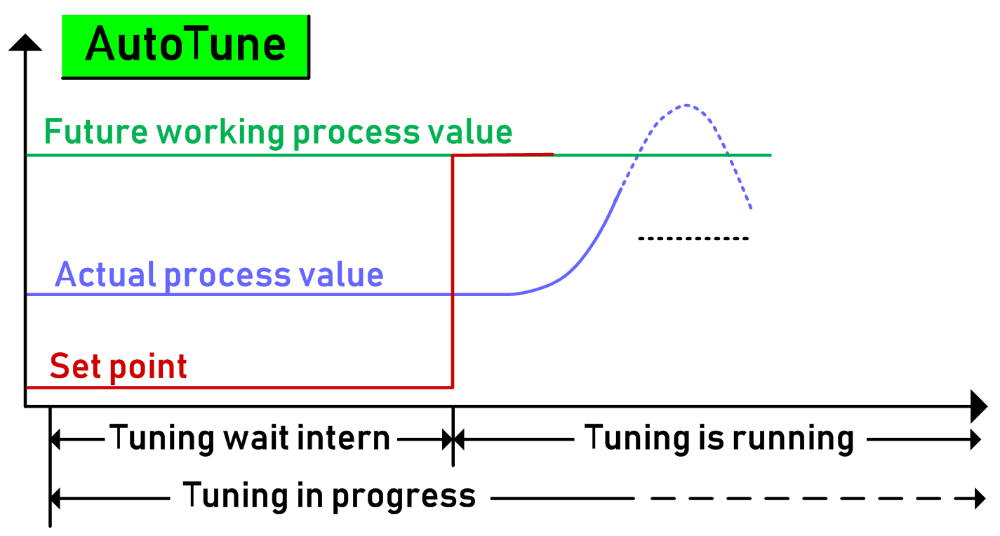
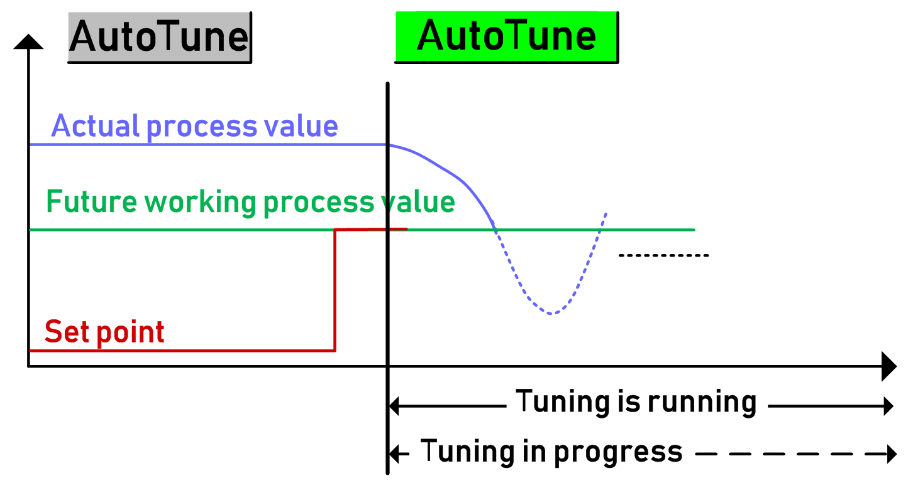
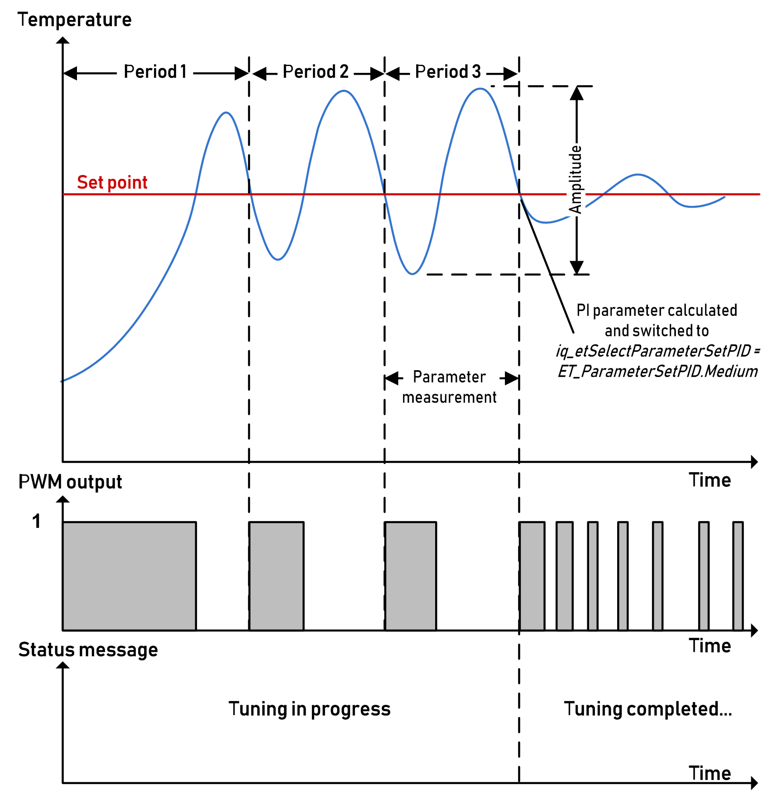
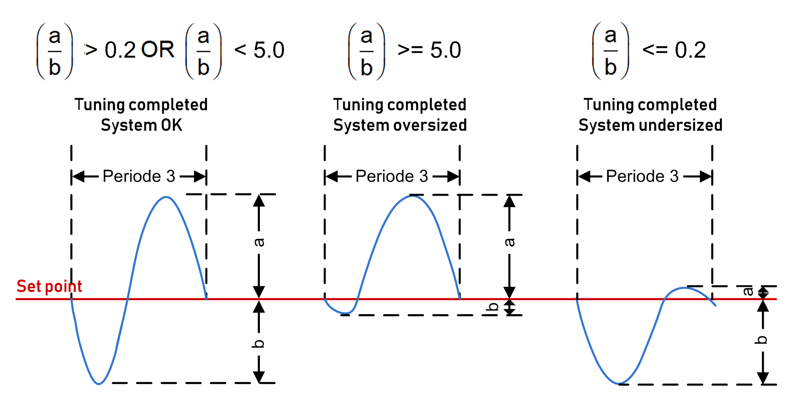

# Auto-Tuning (Heating) - FB\_HeatingControl

## Start Auto-tuning

The set point is the only parameter which is required for auto-tuning. The set point has to be given to input i\_rSetPoint. Start auto-tuning through the pin i\_xAutoTune. The oscillation starts and at the end of the third period, the three sets of PID parameters are calculated. Then auto-tuning is completed.

The PI parameters (D parameters like rTv and rTd are not determined) are calculated based on the different measured times and amplitude of the last period. The calculated PI parameters were given to the array structure element iq\_stParameterSetsPID.

Also refer to chapter [*FB\_HeatingControl*](D-SE-0106246.html#D-SE-0106246).

NOTE: The set point for auto-tuning should be close to the future process (working) temperature. You have to take into account that during auto-tuning the process temperature will overshoot to the given set point temperature. The value of the overshoot depends on the system used (heating energy vs. capacity) and you have to evaluate the general system conditions before auto-tuning (also refer to [*How to Handle Overshoots (Heating)*](D-SE-0106418.html#D-SE-0106418). After auto-tuning, the control mode is set to iq\_etSelectParameterSetPID = ET\_ParammterSetPID.Medium automatically.

Status messages are provided to function block outputs (q\_xAutoTuneActive and q\_etStatusAutoTune) to inform about auto-tuning.

The following two figures show when auto-tuning is running and in progress. Auto-tuning will be running/active after the start command and set point value, independent if the set point value is above or below the actual process value.

To achieve acceptable auto-tuning results, run auto-tuning while the machine is not in production or automatic mode.

## Stop Auto-tuning

To stop auto-tuning, set the input i\_xEnable to FALSE.

## Hysteresis During Auto-tuning

To prevent that one or more oscillations are skipped due to bounces of the process value, there is a hysteresis value used during auto-tuning (default value = 0.2 %).

Also refer to rAutoTuneHysteresis of ST\_TemperatureControl.

**Example:**

At a set point of 200.0 °C (392 °F), the hysteresis is 0.4 °C (0.72 °F). The temperature distance must be greater, like 0.5 °C (0.9 °F), for example, temperature resolution is 0.1 °C (0.18 °F).

* Heating switched on at 199.5 °C (391.1 °F) or less.
* Heating switched off at 200.0 °C (392 °F) or greater.

## Exemplary Sequence of Auto-tuning

After the third oscillation, the three PID parameter sets are calculated and [iq\_etSelectParameterSetPID](D-SE-0106246.html#D-SE-0106246__D-SE-0106246.5) is automatically set to ET\_ParameterSetPID.Medium.

## System Comparison After Auto-tuning

In parallel to the PID parameter calculation, the system is compared. This means that from the last oscillation, the undershoot value is compared with the overshoot value. Depending on the result the system is classified as system OK (balanced), oversized or undersized.

## Auto-tuning Completed

You can select between five PID parameter sets (default, custom, slow, medium, aggressive) by changing iq\_etSelectParametersetPID.

The following example illustrates the effects of the three PID parameter sets (slow, medium, and aggressive).

EIO0000004219.05