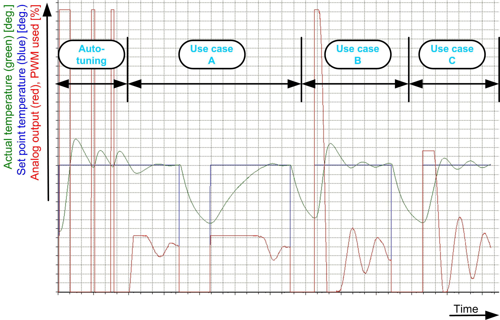

# How to Handle Overshoots (Heating)

## Reducing the Size of Overshoot

If after auto-tuning the status of q\_etStatusAutoTune is set to CompletedSystemOversized, the heating element is oversized.

To reduce the size of an overshoot (if needed), the energy to the heating element can be limited with the input rPidHighLimit of the structure ST\_TemperatureControl.

The input rPidHighLimit limits the output q\_rAnalogOutput, which is, in turn, a basis for the PWM output q\_xPwmOutput.

Also refer to chapter [*FB\_HeatingControl*](D-SE-0106246.html#D-SE-0106246).

NOTE: The limitation of the output must fit to the system. The rPidHighLimit value must be above the steady state value (in this example ~20 %).

| Position | Description |
| --- | --- |
| Auto-tuning | Auto-tuning with rPidHighLimit = 25.  Auto-tuning is done with a value of 100 at output q\_rAnalogOutput (red line). |
| Use case A | Limitation with rPidHighLimit = 25.  After Auto-tuning, the output (red line) is limited and the overshoot of the temperature (green line) is small.  The overshoot is also small if the start temperature is low. However, to reach the set point it takes the greatest amount of time (~4.8 time units) in the example above. |
| Use case B | No limitation with rPidHighLimit = 100.  Start with low temperature. The PID control is not limited and as a result the overshoot is the highest, but the time to reach the set point is the least amount of time (~0.8 time units) in the example above. |
| Use case C | Limitation with rPidHighLimit = 50.  Start with low temperature. The overshoot and the time (~1.4 time units) to reach the set point is somewhere between the use cases A and B. |

EIO0000004219.05