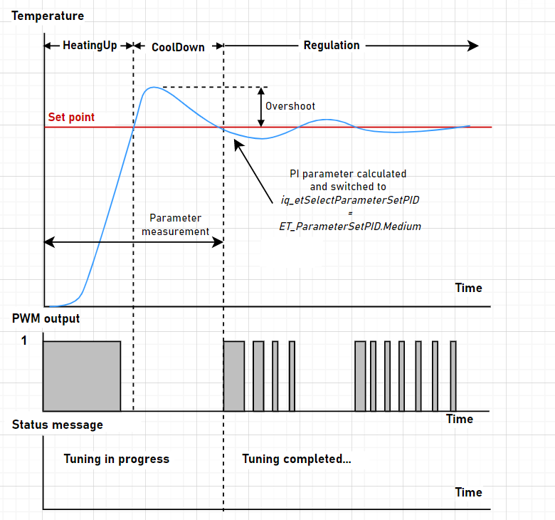
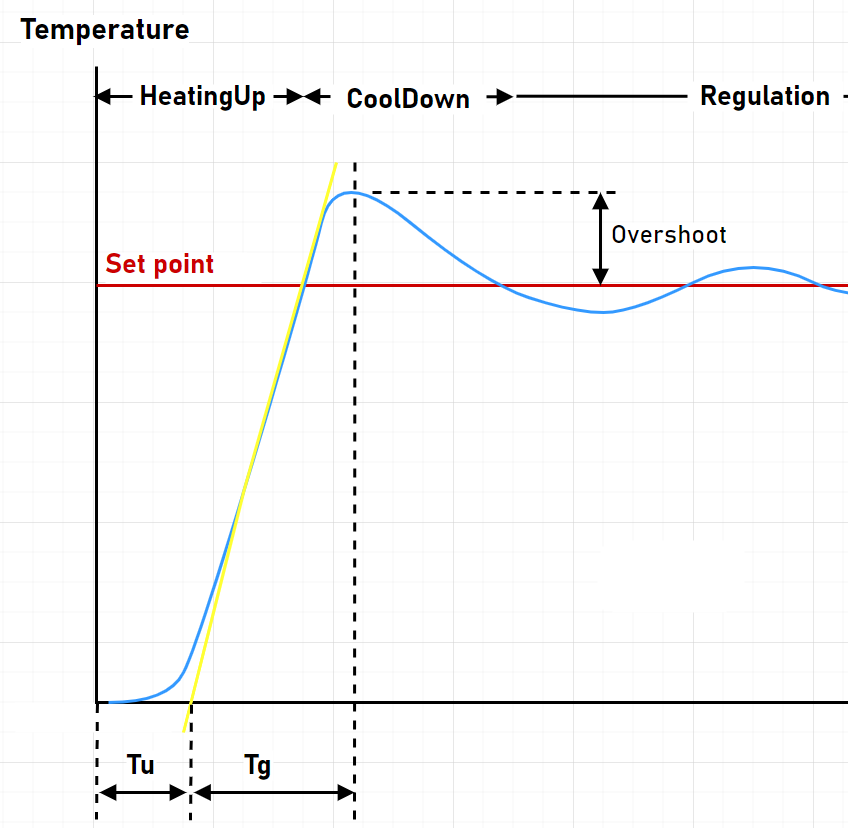
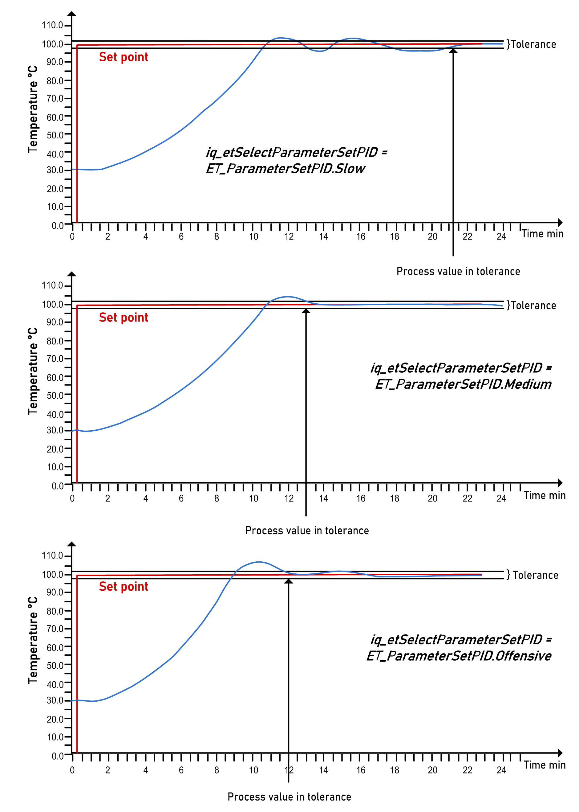

# Auto-Tuning (Heating) - FB\_HeatingControl2

## Start Auto-tuning

The set point is the only parameter which is required for auto-tuning. The set point has to be given to input i\_rSetPoint. Start auto-tuning through the pin i\_xAutoTune. Enter the set point at input i\_rSetPoint. The set point has to be at least 10 °C greater than the present process value. If the temperature difference between the set point and the process value is less than 10 °C, auto-tuning waits until this start condition is fulfilled.

The heating is switched to 100%. The settings i\_stTemperatureControl.rPidHighLimit and i\_stTemperatureControl.rPidLowLimit are not taken into account during auto-tuning. The system is heated up to near the set point. The switch-off point of the heating depends on the set temperature, the system delay time and the maximum rate of temperature rise. After the process value (temperature) has cooled down below the set point, the P and I parameters are determined and the auto-tuning is finished. The PID parameters rKp and rTn are calculated automatically. A Differentiation (D) component rTv is not calculated as it can make the control loop unstable. If a D component is required, for example, to improve reaction to disturbance variables, determine and configure it manually. The calculated PI parameters are given to the array structure element iq\_stParameterSetsPID.

Also refer to [FB\_HeatingControl2](FB_HeatingControl2-771217B0.html).

NOTE: The set point for auto-tuning should be close to the future process (working) temperature. You have to take into account that during auto-tuning the process temperature may overshoot to the given set point temperature. Depending on the system, the set point may not be reached during the heating phase. This is irrelevant for determining the P and I parameters. After auto-tuning, the control mode is set to iq\_etSelectParameterSetPID = ET\_ParameterSetPID.Medium automatically and the limits for PID control defined with i\_stTemperatureControl.rPidHighLimit and i\_stTemperatureControl.rPidLowLimit are taken into account.

Status messages are provided to function block outputs (q\_xAutoTuneActive and q\_etStatusAutoTune) to inform about auto-tuning.

To achieve acceptable auto-tuning results, run auto-tuning while the machine is not in production or automatic mode.

## Stop Auto-tuning

To stop auto-tuning, set the input i\_xEnable to FALSE.

## Exemplary Sequence of Auto-tuning

After the cooling down phase, the three PID parameter sets are calculated and [iq\_etSelectParameterSetPID](D-SE-0106246.html#D-SE-0106246__D-SE-0106246.5) is automatically set to ET\_ParameterSetPID.Medium.

## System Comparison After Auto-tuning

The P and I parameters calculation is mainly based on the reversed tangent method and the two system-relevant parameters:

* system delay time Tu
* system compensation time Tg

The ratio of Tg to Tu determines the controllability of the complete system.

The following applies:

| Ratio of Tg to Tu | Controllability |
| --- | --- |
| <3 | Poorly managable. Control and design measures are required. |
| 3...10 | Moderately managable. |
| >10 | Well managable. |

## Auto-tuning Completed

You can select between five PID parameter sets (default, custom, slow, medium, aggressive) by modifying iq\_etSelectParametersetPID.

The following example illustrates the effects of the three PID parameter sets (slow, medium, and aggressive).

EIO0000004219.05