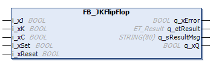

# General Information - FB\_JKFlipFlop

## Overview

|  |  |
| --- | --- |
| Type: | Function block |
| Available as of: | V1.2.9.0 |

## Task

The function block implements a JK flip flop.

## Description

JK flip flop with Set and Reset inputs.

If i\_xSet is set to TRUE, output q\_xQ is set to TRUE independently of the clock pulse.

If i\_xReset is set to TRUE, output q\_xQ is set to FALSE independently of the clock pulse.

If the inputs i\_xSet and i\_xReset are equal, output q\_xQ is set as defined by the JK flip flop.

In the case of a rising edge of the clock pulse, the JK flip flop has the following behavior:

`i_xJ = 0 , i_xK = 0 -> q_xQ` = unchanged

`i_xJ = 0 , i_xK = 1 -> q_xQ` = 0 (flip flop is set to FALSE)

`i_xJ = 1 , i_xK = 0 -> q_xQ` = 1 (flip flop is set to TRUE)

`i_xJ = 1 , i_xK = 1 -> q_xQ` = State is changed (toggle)

## Interface

| Input | Data type | Description |
| --- | --- | --- |
| i\_xJ | BOOL | Setting input |
| i\_xK | BOOL | Resetting input |
| i\_xC | BOOL | Clock pulse |
| i\_xSet | BOOL | TRUE: By means of i\_xReset = FALSE, q\_xQ is set to TRUE |
| i\_xReset | BOOL | TRUE: By means of i\_xSet = FALSE, q\_xQ is set to FALSE |

| Output | Data type | Description |
| --- | --- | --- |
| q\_xError | BOOL | Indicates with TRUE that an error has been detected. For details, refer to q\_etResult and q\_etResultMsg. |
| q\_etResult | [ET\_Result](D-SE-0105329.html#D-SE-0105329) | Provides diagnostic and status information as an enumeration value. |
| q\_sResultMsg | STRING [80] | Provides additional diagnostic and status information as a text message. |
| q\_xQ | BOOL | Signal output of the JK flip flop. |

EIO0000004219.05