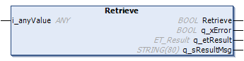

# Retrieve (Method)

## Overview

|  |  |
| --- | --- |
| Type: | Method |
| Available as of: | V1.2.9.0 |

## Task

Reads and removes the latest value stored in the LiFo stack.

## Description

The method Retrieve returns the most recent value stored inside the stack. When a value is retrieved, it is removed from the stack.

NOTE: The data type of the variable assigned to the input i\_anyValue must match the data type of the object(s) stored in the stack.

## Interface

| Input | Data type | Description |
| --- | --- | --- |
| i\_anyValue | ANY | Variable in which the retrieved value is stored. |

| Output | Data type | Description |
| --- | --- | --- |
| q\_xError | BOOL | Indicates with TRUE that an error has been detected. For details, refer to q\_etResult and q\_etResultMsg. |
| q\_etResult | [ET\_Result](D-SE-0105329.html#D-SE-0105329) | Provides diagnostic and status information as an enumeration value. |
| q\_sResultMsg | STRING [80] | Provides additional diagnostic and status information as a text message. |

## Troubleshooting

This table describes the possible issues and their solutions:

| Issue  Outputs of the function indicate the values | Cause | Solution |
| --- | --- | --- |
| q\_xError = TRUE  q\_etResult = TypeMismatch | The data type of the variable assigned to i\_anyValue does not match the data type of the stored object(s). | The data type of the variable assigned to the input i\_anyValue must match the data type of the object(s) stored in the stack. |
| q\_xError = TRUE  q\_etResult = RegisterEmpty | No element can be retrieved as stack is empty. | Store a value to the stack before retrieving one. |

EIO0000004219.05