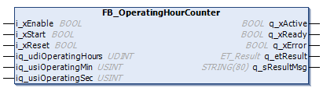

# General Information - FB\_OperatingHourCounter

## Overview

|  |  |
| --- | --- |
| Type: | Function block |
| Available as of: | V1.2.9.0 |

## Task

Operating hours counter

## Description

Seconds, minutes, and hours are counted as long as i\_xStart is TRUE. The values are saved in the external variables connected to the inputs/outputs iq\_udiOperatingHours, iq\_usiOperatingMin, and iq\_usiOperatingSec.

NOTE: It is a good practice to declare the variables holding the counter values as `PERSISTENT` or `RETAIN` so that they keep their value beyond a power cycle of the controller.

## Interface

| Input | Data type | Description |
| --- | --- | --- |
| i\_xEnable | BOOL | Enables the function block.  Refer to [Behavior of Function Blocks with the Input i\_xEnable](i_xEnable-145A050A.html). |
| i\_xStart | BOOL | Starts the operating hours counter. |
| i\_xReset | BOOL | Sets hours, minutes, and seconds to 0. |

| Output | Data type | Description |
| --- | --- | --- |
| q\_xActive | BOOL | Indicates with TRUE that the program code is executing and that it must be executed in each cycle. |
| q\_xReady | BOOL | Indicates with TRUE that the POU is ready and can be controlled via its inputs according to its functionality. |
| q\_xError | BOOL | Indicates with TRUE that an error has been detected. For details, refer to q\_etResult and q\_etResultMsg. |
| q\_etResult | [ET\_Result](D-SE-0105329.html#D-SE-0105329) | Provides diagnostic and status information as an enumeration value. |
| q\_sResultMsg | STRING [80] | Provides additional diagnostic and status information as a text message. |

| Input/Output | Data type | Description |
| --- | --- | --- |
| iq\_udiOperatingHours | UDINT | Variable for hours (0...4.294.967.295). |
| iq\_usiOperatingMin | USINT | Variable for minutes (0...59). |
| iq\_usiOperatingSec | USINT | Variable for seconds (0...59). |

EIO0000004219.05