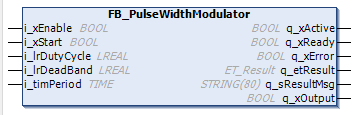
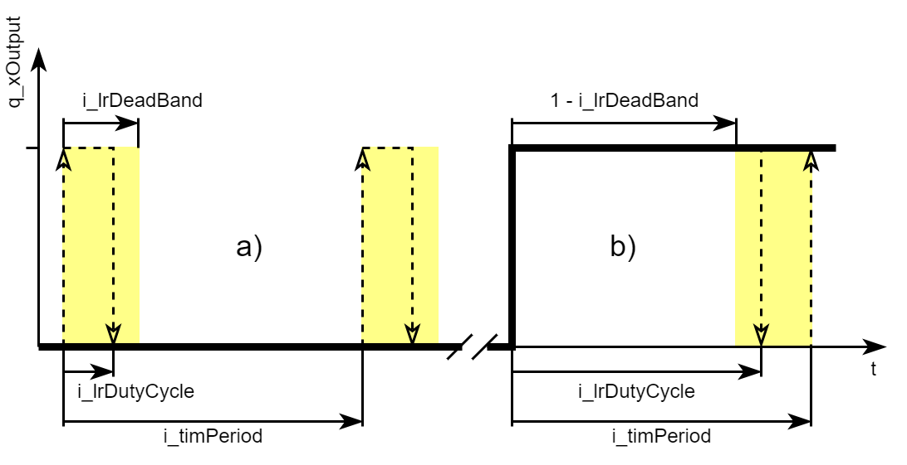

# General Information - FB\_PulseWidthModulator

## Overview

|  |  |
| --- | --- |
| Type: | Function block |
| Available as of: | V1.2.9.0 |

## Task

Pulse width modulator

## Description

The function implements a pulse width modulator (PWM). The PWM generates periodic BOOL output with the period 1/i\_timPeriod.

For an adjustable fraction i\_lrDutyCycle the output is TRUE. The input i\_lrDutyCycle must be in the range 0.0...1.0.

A signal TRUE at i\_xStart starts the modulation. The output begins with TRUE and holds this value for the duration i\_lrDutyCycle \* i\_timPeriod. Then it changes to FALSE for the duration (1-i\_lrInput) \* i\_timPeriod. This pattern is repeated periodically.

If the signal at i\_xStart is removed, the output signal remains at its value until the function block is restarted through a positive signal at i\_xStart.

The more often the function block is called up cyclically during the duration of i\_timPeriod, the more exactly the output periods correspond to the input signal.

To help avoid too short TRUE-phases or too long FALSE-phases, there are guard bands with width i\_lrDeadBand placed at the borders of [0;1] (see figure below).

If i\_lrDutyCycle < i\_lrDeadBand, the output is set to FALSE.

If i\_lrDutyCycle > 1–i\_lrDeadBand, the output is set to TRUE.

The allowed value range of i\_lrDeadBand is 0 to 0.5.

The figure below illustrates the working principle of the dead band.

**a)** i\_lrDutyCycle < i\_lrDeadBand, the output stays FALSE

**b)** i\_lrDutyCycle > 1 - i\_lrDeadBand, the output stays TRUE

During the activation of the function block, the values of the inputs i\_lrDeadBand and i\_timPeriod are latched inside the function block. Changes of these values are not taken into account while the function block is active.

## Interface

| Input | Data type | Description |
| --- | --- | --- |
| i\_xEnable | BOOL | Enables the function block.  Refer to [Behavior of Function Blocks with the Input i\_xEnable](i_xEnable-145A050A.html). |
| i\_xStart | BOOL | Starts the modulator. |
| i\_lrDutyCycle | LREAL | Duty cycle of the output signal. It determines the fraction of one period (i\_timPeriod) in which the output signal is active. The range is 0.0...1.0. |
| i\_lrDeadBand | LREAL | Border range leveling. The range is 0 to 0.5. |
| i\_timPeriod | TIME | Period duration of the modulated signal. |

| Output | Data type | Description |
| --- | --- | --- |
| q\_xActive | BOOL | Indicates with TRUE that the program code is executing and that it must be executed in each cycle. |
| q\_xReady | BOOL | Indicates with TRUE that the POU is ready and can be controlled via its inputs according to its functionality. |
| q\_xError | BOOL | Indicates with TRUE that an error has been detected. For details, refer to q\_etResult and q\_etResultMsg. |
| q\_etResult | [ET\_Result](D-SE-0105329.html#D-SE-0105329) | Provides diagnostic and status information as an enumeration value. |
| q\_sResultMsg | STRING [80] | Provides additional diagnostic and status information as a text message. |
| q\_xOutput | BOOL | Modulated signal. |

EIO0000004219.05