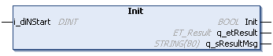

# Init (Method)

## Overview

|  |  |
| --- | --- |
| Type: | Method |
| Available as of: | V1.0.0.0 |
| Versions: | Current version |

## Task

The method Init initializes the random generator FB\_RandomGenerator.

## Description

The random numbers are generated according to the linear congruence method. The required start value diNstart is set during the initialization of the application. The Init method can be used to initialize the function block again. The initialization is then done either with your own diNStart value, that is assigned to the input i\_diNStart, or by a random value generated internally based on the system clock.

The value for diNStart can be any integer superior to 0 which is located within the value range of data type DINT.

## Interface

| Input | Data type | Description |
| --- | --- | --- |
| i\_diNStart | DINT | Specifies the start value, also known as seed value, that is used for generating the random numbers. This is an optional input. If it is not assigned or 0, the required diNStart value is set with a random number generated from the system time. |

| Output | Data type | Description |
| --- | --- | --- |
| q\_etResult | [ET\_Result](D-SE-0105329.html#D-SE-0105329) | Provides diagnostic and status information as an enumeration value. |
| q\_sResultMsg | STRING [80] | Provides additional diagnostic and status information as a text message. |

## Return Value

| Data type | Description |
| --- | --- |
| BOOL | TRUE= The execution of the method was successful.  FALSE = The execution of the method was unsuccessful. |

## Diagnostic Messages

The following table lists the possible values for q\_etResult.

| Name | Data type | Value | Description |
| --- | --- | --- | --- |
| Ok | UDINT | 0 | Operation completed successfully. |
| NStartRange | UDINT | 20 | Value at input i\_diNStart is less than or equal to 0. |
| InternalError | UDINT | 603 | An unexpected error was detected during initialization. |

EIO0000004219.05