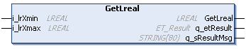

# GetLreal (Method)

## Overview

|  |  |
| --- | --- |
| Type: | Method |
| Available as of: | V1.0.0.0 |
| Versions: | Current version |

## Task

The method GetLreal generates a random number.

## Description

The method GetLreal generates a random number of type LREAL according to the linear congruence method. Refer to FB\_RandomGenerator.

## Interface

| Input | Data type | Description |
| --- | --- | --- |
| i\_lrXmin | LREAL | Lower limit value of the random number. |
| i\_lrXmax | LREAL | Upper limit value of the random number. |

| Output | Data type | Description |
| --- | --- | --- |
| q\_etResult | [ET\_Result](D-SE-0105329.html#D-SE-0105329) | Provides diagnostic and status information as an enumeration value. |
| q\_sResultMsg | STRING [80] | Provides additional diagnostic and status information as a text message. |

## Return Value

| Data type | Description |
| --- | --- |
| LREAL | Generated random number of type LREAL. |

## Diagnostic Messages

The following elements of ET\_Result are used for q\_etResult.

| Name | Data type | Value | Description |
| --- | --- | --- | --- |
| Ok | UDINT | 0 | Operation completed successfully. |
| InitMethodNotCalled | UDINT | 21 | Initialization method has not been executed. |

EIO0000004219.05