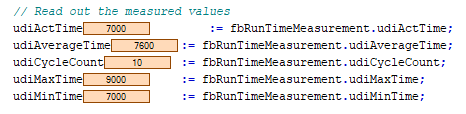

# General Information - FB\_RuntimeMeasurement

## Overview

|  |  |
| --- | --- |
| Type: | Function block |
| Available as of: | V1.0.0.0 |

## Task

The function block FB\_RuntimeMeasurement is used for the runtime measurement of the program code.

## Description

In addition to the actual measured time value, it provides the statistical values for minimum, maximum, and mean values.

## Interface

The function block does not provide any input or output parameters. An instance of the function block must not be called in your application program. To control and monitor the time measurement, the function block provides methods and properties.

## Methods

| Name | Description |
| --- | --- |
| Reset | Resets the function block to its initial state. |
| Start | Starts a new measurement. |
| End | Completes a presently running time measurement. |

## Properties

| Name | Data type | Accessing | Description |
| --- | --- | --- | --- |
| udiActTime | UDINT | Read | Duration of the last measurement.  Unit: ns |
| udiAverageTime | UDINT | Read | Mean duration of the measurements performed since the last reset.  Unit: ns |
| udiCycleCount | UDINT | Read | Number of measurements performed since the last reset. |
| udiMaxTime | UDINT | Read | Longest measured period since the last reset.  Unit: ns |
| udiMinTime | UDINT | Read | Shortest measured period since the last reset.  Unit: ns |
| etResolution | [ET\_TimeResolution](ET_TimeRes-443D3F41.html#ET_TimeRes-443D3F41) | Write | Resolution that is used for indicating the measured values. |

## Code Example

**Declaration**

```
PROGRAM RunTimeMeasurement
VAR
     // Instance of the function block
     fbRunTimeMeasurement    : SE_CTBX.FB_RunTimeMeasurement;

     // Measured variables
     udiActTime              : UDINT;
     udiAverageTime          : UDINT;
     udiCycleCount           : UDINT;
     udiMaxTime              : UDINT;
     udiMinTime              : UDINT;

     // Auxiliary variables
     uiLoopCtr               : UINT;
     uiCycleCtr              : UINT;
     xInit                   : BOOL;
END_VAR
```

**Program code**

```
IF NOT xInit THEN
     // Reset the function block to its initial state
     fbRunTimeMeasurement.Reset();

     xInit                   := TRUE;
     uiCycleCtr              := 0;
END_IF

// Start a new measurement
fbRunTimeMeasurement.Start();

// Code execution
WHILE uiLoopCtr < 100 DO
      uiLoopCtr := uiLoopCtr + 1;
END_WHILE

// Complete a currently running time measurement
fbRunTimeMeasurement.End();

// Get measured values after 10 program cycles
uiCycleCtr := uiCycleCtr + 1;

IF uiCycleCtr = 10 THEN
     // Read out the measured values
     udiActTime              := fbRunTimeMeasurement.udiActTime;
     udiAverageTime          := fbRunTimeMeasurement.udiAverageTime;
     udiCycleCount           := fbRunTimeMeasurement.udiCycleCount;
     udiMaxTime              := fbRunTimeMeasurement.udiMaxTime;
     udiMinTime              := fbRunTimeMeasurement.udiMinTime;

     // Restart measurement
     xInit := FALSE;
END_IF
```

**Measured values with an M251 controller (MAST cycle time of 10 ms)**



EIO0000004219.05