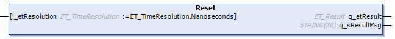

# Reset (Method)

## Overview

|  |  |
| --- | --- |
| Type: | Method |
| Available as of: | V1.0.0.0 |
| Versions: | Current version |

## Task

The method Reset resets the function block to its initial state and adapts the resolution.

## Description

The measured values and statistical data are reset to 0 and the resolution can be adapted for the next measurements.

## Interface

| Input | Data type | Description |
| --- | --- | --- |
| i\_etResolution | [ET\_TimeResolution](ET_TimeRes-443D3F41.html) | Optional input to adapt the resolution of the measured value.  Default value: ET\_TimeResolution.Nanoseconds |

| Output | Data type | Description |
| --- | --- | --- |
| q\_etResult | [ET\_Result](D-SE-0105329.html#D-SE-0105329) | Provides diagnostic and status information as an enumeration value. |
| q\_sResultMsg | STRING [80] | Provides additional diagnostic and status information as a text message. |

## Diagnostic Messages

The following element of ET\_Result is used for q\_etResult.

| Name | Data type | Value | Description |
| --- | --- | --- | --- |
| Ok | UDINT | 0 | Operation completed successfully. |

EIO0000004219.05