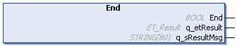

# End (Method)

## Overview

|  |  |
| --- | --- |
| Type: | Method |
| Available as of: | V1.0.0.0 |
| Versions: | Current version |

## Task

The method End completes a presently running time measurement.

## Description

The presently running time measurement is being completed and evaluated. The statistical data of the function block are being updated.

## Interface

| Output | Data type | Description |
| --- | --- | --- |
| q\_etResult | [ET\_Result](D-SE-0105329.html#D-SE-0105329) | Provides diagnostic and status information as an enumeration value. |
| q\_sResultMsg | STRING [80] | Provides additional diagnostic and status information as a text message. |

## Return Value

| Data type | Description |
| --- | --- |
| BOOL | Indicates whether or not the execution of the method was successful. |

## Diagnostic Messages

The following elements of ET\_Result are used for q\_etResult.

| Name | Data type | Value | Description |
| --- | --- | --- | --- |
| Ok | UDINT | 0 | Operation completed successfully. |
| StartMethodNotCalled | UDINT | 22 | Start method has not yet been executed. |
| CheckSumOverflow | UDINT | 23 | Checksum overflow.  NOTE: To calculate the return value of the property udiAverageTime, the checksum is calculated each time the method End is called. The limit of the total sum is 4294967295 (based on the UDINT data type). Verify the q\_etResult output each time the method End is called. If q\_etResult = CheckSumOverflow, the method Reset must be called. |
| ValueOverflow | UDINT | 24 | Value overflow detected. Verify the q\_etResult output for detailed information. Decrease the resolution or use FB\_RuntimeMeasurement2. |
| InvalidInput | UDINT | 25 | The value of the specified input is invalid. Verify the q\_etResult output for detailed information. |

EIO0000004219.05