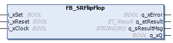

# General Information - FB\_SRFlipFlop

## Overview

|  |  |
| --- | --- |
| Type: | Function block |
| Available as of: | V1.2.9.0 |

## Task

The function block implements a clock-pulse controlled SR flip flop.

## Description

Clock-pulse controlled SR flip flop with reset priority.

If the clock pulse is TRUE, the clock-pulse controlled SR flip flop with reset priority behaves as follows:

i\_xS = 0 , i\_xR = 0 -> q\_xQ = unchanged

i\_xS = 0 , i\_xR = 1 -> q\_xQ = 0 (flip flop is set to FALSE)

i\_xS = 1 , i\_xR = 0 -> q\_xQ = 1 (flip flop is set to TRUE)

i\_xS = 1 , i\_xR = 1 -> q\_xQ = 1 (flip flop is set to TRUE)

## Interface

| Input | Data type | Description |
| --- | --- | --- |
| i\_xSet | BOOL | Setting input |
| i\_xReset | BOOL | Resetting input |
| i\_xClock | BOOL | Clock pulse |

| Output | Data type | Description |
| --- | --- | --- |
| q\_xError | BOOL | Indicates with TRUE that an error has been detected. For details, refer to q\_etResult and q\_etResultMsg. |
| q\_etResult | [ET\_Result](D-SE-0105329.html#D-SE-0105329) | Provides diagnostic and status information as an enumeration value. |
| q\_sResultMsg | STRING [80] | Provides additional diagnostic and status information as a text message. |
| q\_xQ | BOOL | Signal output of the SR flip flop. |

EIO0000004219.05