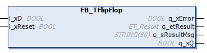

# General Information - FB\_TFlipFlop

## Overview

|  |  |
| --- | --- |
| Type: | Function block |
| Available as of: | V1.2.9.0 |

## Task

The function block implements a T flip flop.

## Description

T flip flop (toggle) with Reset input

If i\_xReset is set to TRUE, output q\_xQ is set to FALSE independently of the input i\_xD.

In the case of a rising edge of the input i\_xD, the T flip flop has the following behavior:

q\_xQ = NOT q\_xQ

## Interface

| Input | Data type | Description |
| --- | --- | --- |
| i\_xD | BOOL | Toggle input |
| i\_xReset | BOOL | Resetting input |

| Output | Data type | Description |
| --- | --- | --- |
| q\_xError | BOOL | Indicates with TRUE that an error has been detected. For details, refer to q\_etResult and q\_etResultMsg. |
| q\_etResult | [ET\_Result](D-SE-0105329.html#D-SE-0105329) | Provides diagnostic and status information as an enumeration value. |
| q\_sResultMsg | STRING [80] | Provides additional diagnostic and status information as a text message. |
| q\_xQ | BOOL | Signal output of the T flip flop. |

EIO0000004219.05