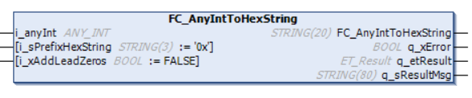

# FC\_AnyIntToHexString - General Information

## Overview

|  |  |
| --- | --- |
| Type: | Function |
| Available as of: | V1.3.0.0 |

## Task

Convert an integer value to a string in hexadecimal format.

## Description

The function converts an integer value to a string in hexadecimal format.

The prefix of the output is specified by the optional input variable i\_sPrefixHexString.

NOTE: If the input is unassigned, the prefix 0x is used by default.

With the optional input i\_xAddLeadZeros, you can specify whether the string result contains leading zeros.

## Interface

| Input | Data type | Description |
| --- | --- | --- |
| i\_anyInt | ANY\_INT | Integer value to be converted |
| i\_sPrefixHexString | STRING[3]  default = 0x | Optional input  Prefix for the output value |
| i\_xAddLeadZeros | BOOL  default = FALSE | Optional input  TRUE: The leading zeros are included in the hexadecimal string.  FALSE: The leading zeros are not part of the hexadecimal string. |

| Output | Data type | Description |
| --- | --- | --- |
| q\_xError | BOOL | Error detected |
| q\_etResult | [ET\_Result](D-SE-0105329.html#D-SE-0105329) | Provides diagnostic and status information as an enumeration value. |
| q\_sResultMsg | STRING[80] | Provides additional diagnostic and status information as a text message. |

## Return Value

| Data type | Description |
| --- | --- |
| STRING[20] | Integer value as a string in hexadecimal format with the specified prefix. |

EIO0000004219.05