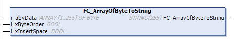

# FC\_ArrayOfByteToString - General Information

## Overview

|  |  |
| --- | --- |
| Type: | Function |
| Available as of: | V1.2.9.0 |

## Task

Convert an array of bytes to a variable of type STRING.

## Interface

| Input | Data type | Description |
| --- | --- | --- |
| i\_abyData | ARRAY[1..255] OF BYTE | Byte values to be converted. |
| i\_xByteOrder | BOOL | If FALSE, the bytes stored in the returned string are swapped.  If TRUE, the bytes in the returned string are in the same sequence like in the array. |
| i\_xInsertSpace | BOOL | If TRUE and i\_xByteOrder is FALSE, the second last character in the string is replaced by a space (20 hex), otherwise it is set with the value 0 and the string is terminated before the last character. |

## Return Value

| Data type | Description |
| --- | --- |
| STRING[255] | The byte stream of the array i\_abyData. |

EIO0000004219.05