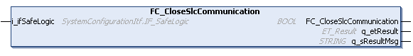

# FC\_CloseSlcCommunication - General Information

## Overview

|  |  |
| --- | --- |
| Type: | Function |
| Available as of: | V1.0.0.0 |
| Versions: | Current version |

## Description

NOTE: This function is only supported by PacDrive LMC controllers.

The function FC\_CloseSlcCommunication deactivates the port rules for the controller firewall. (Also refer to FC\_OpenSlcCommunication).

## Interface

| Input | Data type | Description |
| --- | --- | --- |
| i\_ifSafeLogic | SystemConfigurationItf.IF\_SafeLogic | Specifies the SLC (Safety Logic Controller) for which the communication should be disabled. |

| Output | Data type | Description |
| --- | --- | --- |
| q\_etResult | [ET\_Result](D-SE-0105329.html#D-SE-0105329) | Provides diagnostic and status information as an enumeration value. |
| q\_sResultMsg | STRING [80] | Provides additional diagnostic and status information as a text message. |

## Return Value

| Data type | Description |
| --- | --- |
| BOOL | Indicates whether or not the execution of the method was successful. |

## Diagnostic Messages

The following elements of ET\_Result are used for q\_etResult.

| Name | Data type | Value | Description |
| --- | --- | --- | --- |
| Ok | UDINT | 0 | Operation completed successfully. |
| FunctionNotSupported | UDINT | 100 | Function not available for this controller. |
| InvalidIfSafeLogic | UDINT | 200 | The interface assigned to i\_ifSafeLogic must be provided by an instance of the Safety Logic Controller in the Devices tree of the project. |

EIO0000004219.05