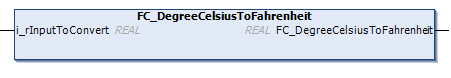

# FC\_DegreeCelsiusToFahrenheit - General Information

## Overview

|  |  |
| --- | --- |
| Type: | Function |
| Available as of: | V1.2.3.0 |
| Versions: | Current version |

## Task

The function FC\_DegreeCelsiusToFahrenheit converts a temperature value from degrees Celsius to degrees Fahrenheit.

## Description

The function converts a temperature value from degrees Celsius to degrees Fahrenheit.

## Interface

| Input | Data type | Description |
| --- | --- | --- |
| i\_rInputToConvert | REAL | Temperature value in degrees Celsius |

## Return Value

| Data type | Description |
| --- | --- |
| REAL | Temperature value in degrees Fahrenheit |

EIO0000004219.05