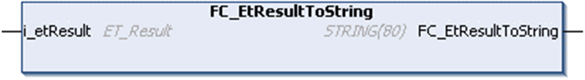

# FC\_EtResultToString

## Overview

|  |  |
| --- | --- |
| Type: | Function |
| Available as of: | V1.0.0.0 |
| Inherits from: | - |
| Implements: | - |

## Task

Convert an enumeration element of type ET\_Result to a variable of type STRING.

## Functional Description

Using the function FC\_EtResultToString, you can convert an enumeration element of type ET\_Result to a variable of type STRING.

## Interface

| Input | Data type | Description |
| --- | --- | --- |
| i\_etResult | ET\_Result | Enumeration with the result. |

## Return Value

| Data type | Description |
| --- | --- |
| STRING(80) | The ET\_Result converted to text.  If i\_etResult is indeterminable the return value is:  `Unknown Result: <Value of the input i_etResult>` |

EIO0000004219.05