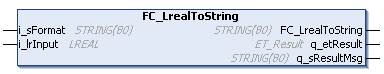

# FC\_LrealToString - General Information

## Overview

|  |  |
| --- | --- |
| Type: | Function |
| Available as of: | V1.0.0.0 |
| Versions: | Current version |

## Task

The function FC\_LrealToString converts numerical values into a formatted string.

## Description

The function converts any numerical value to a STRING with freely defined format.

i\_sFormat = '[B][S][PPPP][.][FFFF][A][aa]'

| Numerical value  (i\_lrInput) | Defined format  (i\_sFormat) | Result  STRING[80] |
| --- | --- | --- |
| 12.3456 | ‘10#00.000000L15’ | ‘12.345600 ‘ (6 spaces at the right-hand side) |

The format is specified in the input variable i\_sFormat as follows:

| Placeholder | Description |
| --- | --- |
| [B] | Sets the base of the number representation:   * ‘2’ = binary  For example, when ‘2#’ is entered, a decimal value of 30 is converted to ‘11110’. * ‘8’ = octal  For example, when ‘8#’ is entered, a decimal value of 30 is converted to ‘36’. * ‘10’ = decimal * ‘16’ = hexadecimal  For example, when ‘16#’ is entered, a decimal value of 30 is converted to ‘1E’.   If no value is given for ‘B’, ‘10’ is used as default value. |
| [S] | Represent the mathematical sign. If a base is entered, then the mathematical sign representation must also be specified. Otherwise, this entry is dispensed with and ‘#’ is used as default. As a basic principle, a minus sign precedes negative values, independent of the format specification.  In other respects, the following options exist for formatting:   * ‘#’: Nothing precedes non-negative numbers. For example, when ‘10#’ is entered, a decimal value of 123 is converted to ‘123’. A negative decimal value -123 stays as is ‘-123’. * ‘-’: An empty space precedes non-negative numbers. For example, when ‘10-’ is entered, a decimal value of 123 is converted to ‘[space]123’. A negative decimal value -123 stays as is ‘-123’. * ‘+’: A ‘+’ (plus sign) precedes positive numbers, an empty space precedes 0. For example, when ‘10+’ is entered, a decimal value of 123 is converted to ‘+123’. A negative decimal value -123 stays as is ‘-123’. |
| [PPPP] | Each ‘P’ character before the decimal point represents a place preceding the decimal point in the output. This is used to set the minimum number of characters that are reserved for the whole number component. Additionally this defines the content for the output when the numerical representation is shorter than the format string expects.  If ‘P’ is a space, then a space is inserted at that position. If ‘P’ is zero, then a zero is inserted. Using this portion of the format input you can implement leading zeros or, in other words, you can set the decimal point to a fixed position from the left edge of the output string.  If only a zero is specified, all places preceding the decimal point of the transferred LREAL are converted to a string.  For example:   * When ‘10#000000’ is entered, a decimal value of 123 is converted to ‘000123’. * When ‘10#[6 spaces’ is entered, a decimal value of 123 is converted to ‘[3 spaces]123’. * When ‘10+0000’ is entered, a decimal value of 123 is converted to ‘+0123’. |
| [.] | The decimal point is only required when fractional characters are desired. |
| [FFFF] | The ’F’ signs following the decimal point determine the number of spaces following the decimal point in the output. Each ’F’ represents one position following the decimal point. If the input value has more positions following the decimal point than the format provides for, the remainder is deleted. If it has fewer, then it is filled up according to ’F’. If ’F’ is an empty space, then an empty space is put into that position. If ’F’ is zero, then a zero is put there. If ’F’ is an underline, nothing is entered. This input is used to either fix the number of positions after the decimal point or to determine the distance of the decimal point from the right edge.  For example:   * When ‘10#.0’ is entered, a decimal value of 123.456 is converted to ‘123.4’. * When ‘10+.000’ is entered, a decimal value of 123.456 is converted to ‘+123.456’. * When ‘10-.0000’ is entered, a decimal value of 123.456 is converted to ‘[space]123.4560’. * When ‘10-.00’ is entered, a decimal value of -123.456 is converted to ‘-123.45’. * When ‘10-0000.000’ is entered, a decimal value of -123.456 is converted to ‘-0123.456’. |
| [A]  [aa] | ‘A’ an ‘aa’ determine if the output has a fixed total length and if it is to be left or right justified or centered. Possible values are ‘L’ for left justified, ‘R’ for right justified; or ‘C’ for centered.  The desired length of the output is determined by ‘aa’. If the output has more characters than specified, the value to the right is filled out with empty spaces so that the numbers are displayed according to ‘A’.  If no adjustment is desired, simply do not specify any ‘A’ or ‘aa’ in the format string. But if one of the two values is specified, then the other must be specified as well.  For example:   * When ‘10#.000L20’ is entered, a decimal value of 123.456 is converted to ‘123.456[13 spaces]’. * When ‘10+.000R20’ is entered, a decimal value of 123.456 is converted to ‘[12 spaces]+123.456’. * When ‘10#.00C20’ is entered, a decimal value of 123.456 is converted to ‘[7 spaces]123.46[7 spaces]’. |

## Interface

| Input | Data type | Description |
| --- | --- | --- |
| i\_sFormat | STRING[80] | Formatting the output. |
| i\_lrInput | LREAL | The value to be formatted. |

| Output | Data type | Description |
| --- | --- | --- |
| q\_etResult | [ET\_Result](D-SE-0105329.html#D-SE-0105329) | Provides diagnostic and status information as an enumeration value. |
| q\_sResultMsg | STRING [80] | Provides additional diagnostic and status information as a text message. |

## Return Value

| Data type | Description |
| --- | --- |
| STRING[80] | The value transferred at i\_lrInput is converted to a STRING in the specified format and returned. |

## Diagnostic Messages

The following elements of ET\_Result are used for q\_etResult.

| Name | Data type | Value | Description |
| --- | --- | --- | --- |
| Ok | UDINT | 0 | Operation completed successfully. |
| LrealValueTooBig | UDINT | 2 | LREAL value is too large.  Limit = +/- 2000000000 |

EIO0000004219.05