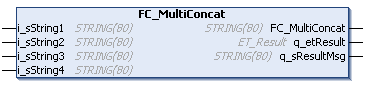

# FC\_MultiConcat - General Information

## Overview

|  |  |
| --- | --- |
| Type: | Function |
| Available as of: | V1.0.0.0 |
| Versions: | Current version |

## Task

The function FC\_MultiConcat concatenates four given strings to a single, composite string.

## Description

The function concatenates the four input strings according to their sequence to a composite STRING with a maximum length of 80 character.

## Interface

| Input | Data type | Description |
| --- | --- | --- |
| i\_sString1 | STRING[80] | String 1 |
| i\_sString2 | STRING[80] | String 2 |
| i\_sString3 | STRING[80] | String 3 |
| i\_sString4 | STRING[80] | String 4 |

| Output | Data type | Description |
| --- | --- | --- |
| q\_etResult | [ET\_Result](D-SE-0105329.html#D-SE-0105329) | Provides diagnostic and status information as an enumeration value. |
| q\_sResultMsg | STRING [80] | Provides additional diagnostic and status information as a text message. |

## Return Value

| Data type | Description |
| --- | --- |
| STRING[80] | The composite string. |

## Diagnostic Messages

The following elements of ET\_Result are used for q\_etResult.

| Name | Data type | Value | Description |
| --- | --- | --- | --- |
| Ok | UDINT | 0 | Operation completed successfully. |
| StringTooLong | UDINT | 1 | Concatenated string contains more than 80 characters. |

EIO0000004219.05