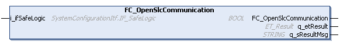

# FC\_OpenSlcCommunication - General Information

## Overview

|  |  |
| --- | --- |
| Type: | Function |
| Available as of: | V1.0.0.0 |
| Versions: | Current version |

## Description

NOTE: This function is only supported by PacDrive LMC controllers.

The function FC\_OpenSlcCommunication activates the required port rules for the controller firewall. This allows for communication of the programming software with the controller and for collecting messages for the logger (see the Safe Logger tab in the device editor of the PacDrive LMC controllers).

* After a restart, the firewall is configured according to the default configuration file. Refer to [*How to Configure the Firewall for PacDrive LMC Controllers User Guide*](../../../../../api/crossBook?lang=en-US&virtualBookName=FireLmcUG&topicID=D_SE_0104380).
* It is a good practice to keep the port rules activated only as long as needed. Use the FC\_CloseSlcCommunication to deactivate the port rules after your communication to the SLC (Safety Logic Controller) is no longer needed.

  | WARNING | |
  | --- | --- |
  |  | UNAUTHENTICATED ACCESS AND SUBSEQUENT UNAUTHORIZED MACHINE OPERATION  + Evaluate whether your environment or your machines are connected to your critical infrastructure and, if so, take appropriate steps in terms of prevention, based on Defense-in-Depth, before connecting the automation system to any network. + Limit the number of devices connected to a network to the minimum necessary. + Isolate your industrial network from other networks inside your company. + Protect any network against unintended access by using firewalls, VPN, or other, proven security measures. + Monitor activities within your systems. + Prevent subject devices from direct access or direct link by unauthorized parties or unauthenticated actions. + Prepare a recovery plan including backup of your system and process information.  Failure to follow these instructions can result in death, serious injury, or equipment damage. |

## Interface

| Input | Data type | Description |
| --- | --- | --- |
| i\_ifSafeLogic | SystemConfigurationItf.IF\_SafeLogic | Specifies the SLC (Safety Logic Controller) for which the communication should be enabled. |

| Output | Data type | Description |
| --- | --- | --- |
| q\_etResult | [ET\_Result](D-SE-0105329.html#D-SE-0105329) | Provides diagnostic and status information as an enumeration value. |
| q\_sResultMsg | STRING [80] | Provides additional diagnostic and status information as a text message. |

## Return Value

| Data type | Description |
| --- | --- |
| BOOL | TRUE = SLC connection settings were adapted successfully.  FALSE = SLC connecting settings cannot be set. |

## Diagnostic Messages

The following elements of ET\_Result are used for q\_etResult.

| Name | Data type | Value | Description |
| --- | --- | --- | --- |
| Ok | UDINT | 0 | Operation completed successfully. |
| FunctionNotSupported | UDINT | 100 | Function not available for this controller. |
| InvalidIfSafeLogic | UDINT | 200 | The interface assigned to i\_ifSafeLogic must be provided by an instance of the Safety Logic Controller in the Devices tree of the project. |

EIO0000004219.05