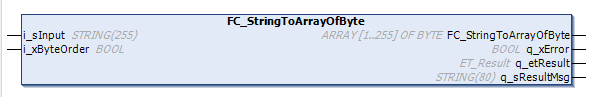

# FC\_StringToArrayOfByte - General Information

## Overview

|  |  |
| --- | --- |
| Type: | Function |
| Available as of: | V1.2.9.0 |

## Task

Convert a string into an array of byte.

## Description

The function converts a string into an array of byte values. The byte values correspond to the characters of the string. The number of bytes per character depends on STRING encoding. Refer to the [Programming Guide\Programming Reference\Data Types\Standard Data Types](../../../../../api/crossBook?lang=en-US&virtualBookName=SoMProg&topicID=D_SE_0083662).

## Interface

| Input | Data type | Description |
| --- | --- | --- |
| i\_sInput | STRING[255] | The input string to be copied into the array of byte. |
| i\_xByteOrder | BOOL | TRUE: The byte order in the array corresponds to the byte order of the string.  FALSE: The bytes in the array are swapped. |

| Output | Data type | Description |
| --- | --- | --- |
| q\_xError | BOOL | Error detected |
| q\_etResult | [ET\_Result](D-SE-0105329.html#D-SE-0105329) | Provides diagnostic and status information as an enumeration value. |
| q\_sResultMsg | STRING[80] | Provides additional diagnostic and status information as a text message. |

## Return Value

| Data type | Description |
| --- | --- |
| ARRAY[1..255] OF BYTE | The byte stream of the string i\_sInput. |

EIO0000004219.05