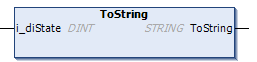

# ToString (Method)

## Overview

|  |  |
| --- | --- |
| Type: | Method |
| Available as of: | V1.2.9.0 |

## Task

Convert a numerical value representing the state to a string

## Description

The method ToString converts a numerical value representing the state to a string.

The return value of type STRING is used inside the FB\_FiniteStateMachine to add the return value to a log entry in the Application Logger and/or the transition logger.

## Interface

| Input | Data type | Description |
| --- | --- | --- |
| i\_diState | DINT | Indicates the state as a numerical value. |

EIO0000004219.05